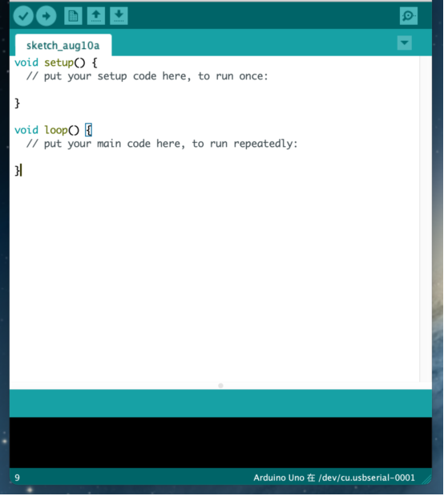

# 4.Development Environment Configuration

## 1.Get Started With Arduino 

**1.1 Install the Arduino IDE**

When you get control board, you need to download Arduino IDE and driver firstly.

You could download Arduino IDE from the official website:

<https://www.arduino.cc/>, click the **SOFTWARE** on the browse bar, click“DOWNLOADS” to enter download page, as shown below:

There are various versions of IDE for Arduino such as Windows，Mac as well as Linux(as shown below). Just download a version compatible with your system.

Here we will show you how to download and install the windows version of Arduino IDE.

There are two versions of IDE for Windows system. You can choose between the installer (.exe) and the Zip file. For installer, it can be directly downloaded, without the need of installing it manually. However, for Zip package, you will need to install the driver manually.

You just need to click JUST DOWNLOAD.

**1.2 Install the Driver of the V4.0 Board**

Let’s install the driver of keyestudio V4.0 development board. The USB-TTL chip on the V4.0 board adopts the CP2102 serial chip. The driver program of this chip is included in Arduino 1.8 version and above (<https://www.silabs.com/products/development-tools/software/usb-to-uart-bridge-vcp-drivers>), which is convenient. Plugging on USB port of board, the computer can recognize the hardware and automatically install the driver of CP2102.

If you install unsuccessfully, or intend to install manually, please open the device manager of computer. Right click Computer----- Properties----- Device Manager. 

The yellow exclamation mark on the page implies an unsuccessful installation and you should double click , then click “**Update Drive...**”to update the driver.

Click“**Browse my computer for drivers**”to find the downloaded Arduino software.

There is a DRIVERS folder in Arduino software installed package, open the driver folder and check the driver of CP210X series chips.

Click “Browse”, then search the driver of CP2102 and click“Next”,

After a while, the driver is installed successfully

When opening the device manager, we will find the yellow exclamation mark disappear. The driver of CP2102 is installed successfully.

**1.3 Install Other Visions of Driver**

If your board is an Arduino UNO development board, follow these steps to install the driver: 

First, click Computer Properties - Device Manager , then the unknown hardware will be displayed.

Second, click “Update Drive...”to update the driver

Then click“**Browse my computer for driver software**”

Click "Browse..."  to find the location where the Arduino software is installed on your computer, then open the drivers folder, and click "Next".

The driver is installed successfully

At this time, open the computer device manager, which will display Arduino serial port. 

**1.4 Arduino IDE** **Setting**

Clickicon，and open Arduino IDE.

To avoid any errors when uploading the program to the board, you must select the correct name of Arduino board that matches the board connected to your computer. As shown below:

Then select the correct COM port (you can see the corresponding COM port after the driver is successfully installed)

A- Used to verify whether there is any compiling mistakes or not.

B- Used to upload the sketch to your Arduino board.

C- Used to create shortcut window of a new sketch.

D- Used to directly open an example sketch.

E- Used to save the sketch.

F- Used to send the serial data received from board to the serial monitor.

**1.5 Start First Program**

Open the file to select **Example**, and click **BASIC**\>**BLINK**, as shown below:

Set the correct **COM port,** and the corresponding board and COM port are shown on the lower right of IDE.

Click  to start compiling the program

Clickto upload the program

After the program is uploaded successfully, the onboard LED will be on for 1s and off for 1s. Congratulation, you have finished the first program.

## 2. Install the Driver on MAC System 

**2.1 Download Arduino IDE**

**2.2 How to Install the CP2102 Driver**

(Note: If you haven’t installed the driver installed, please do the following.) 

(1) Connect the keyestudio V4.0 development board to your MacOS computer using a USB cable and open the Arduino IDE. 

Click **Tools→Board: Arduino Uno** and **/dev/cu.usbserial-0001.**

Clickto upload the test code

Note: If the the upload fails, follow the steps below to install the CP2102 driver.  Perform steps (2) to (16). 

(2）Download link for CP2102：

[https://www.silabs.com/products/development-tools/software/usb-to-uart-bridge-vcp-drivers](https://www.silabs.com/products/development-tools/software/usb-to-uart-bridge-vcp-drivers)

（3）Download MacOS version

（4）Unzip the downloaded package

（5）Open the folder and double-click“SiLabsUSBDriverDisk.dmg”file

Then you can see the following file

（6）Double-click**“Install CP210x VCP Driver”，tap**“**Don’t warn me when opening application on this disk image**”and click“**Open**”.

（7）Click“**Continue**”

（8）Click“**Agree**”，then tap“**Continue**”

（9）Click“**Continue**”，then input your user password

10. Select“**Select Open Security Preferences**”
    
    
    
    11. Click on security lock and enter your user password to authorize.
    
    
    
    
    
    12. When you see that the lock is opened, click "Allow" 
    
        
    
    13. Return to the installation interface and wait for the installation as prompted.
    
    
    
    14. The installation is successful
    
    

15. Open arduinoIDE，click“**Tools**”and tap **Arduino Uno** and“**/dev/cu.SLAB\_USBtoUAPT**”

16. Clickto upload the program, and you can see the program burned successfully

## 3.How to Add a Library?

**3.1 What are Libraries ?**

[Libraries ](https://www.arduino.cc/en/Reference/Libraries)are a collection of code that make it easy for you to connect a sensor,display, module, etc.

For example, the built-in LiquidCrystal library helps talk to LCD displays. There are hundreds of additional libraries available on the Internet for download.

The built-in libraries and some of these additional libraries are listed in the reference.

**3.2 How to Install a Library ?**

Here we will introduce the most simple way to add libraries .

**Step 1：**After downloading well the Arduino IDE, you can right-click the icon of Arduino IDE. Find the option "Open file location"

**Step 2:** Click Open file location \>libraries

**Step 3：**Next, find out the“libraries”folder. Copy them into libraries of Arduino

