# 5.Product Installation

Installation

| **Part 1**           |                                                              |
| -------------------- | :----------------------------------------------------------: |
| Components Needed    |  |
| Installation Diagram |  |
| Prototype            | **** |
| **Part 2**           |                                                              |
| Components Needed    | **** |
| Installation Diagram | ****   |
| Prototype            | **** |
| **Part 3**           |                                                              |
| Components Needed    |  |
| Installation Diagram | **** |
| Plug Wire            |  |
| Prototype            | **** |

| **Part 4**              |                                                              |
| ----------------------- | ------------------------------------------------------------ |
| Components Needed       | 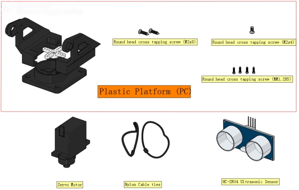                                     |
| Rotate the servo to 90° | The below Arduino code is provided in the file. Open the code and burn it to the Keyestudio 4.0 motherboard, as shown below：<br />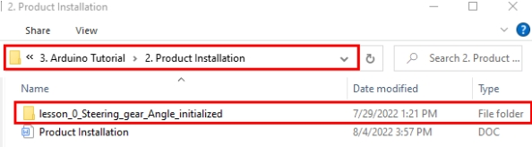 |
| Installation Diagram    | 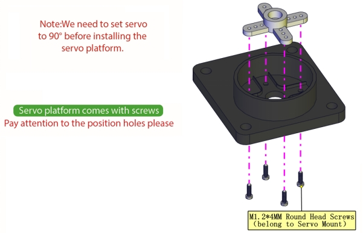<br />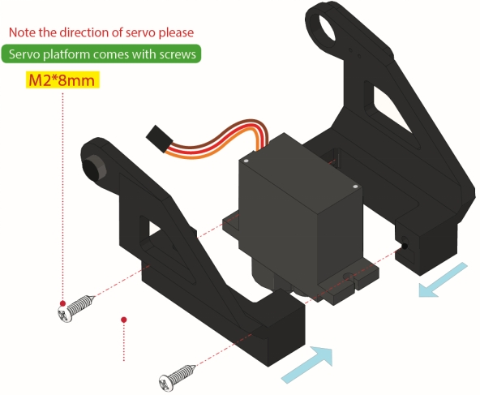<br />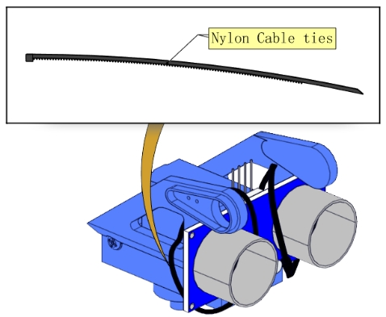<br />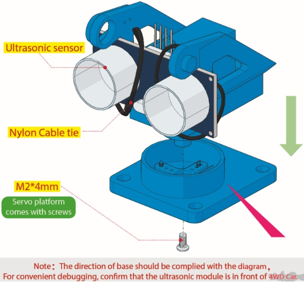 |
| Prototype               | 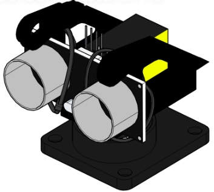                                     |

| Servo  | 8833 Motor Driver Expansion Board |
| :----: | :-------------------------------: |
| Brown  |                 G                 |
|  Red   |                5V                 |
| Yellow |                A3                 |

```c
//*******************************************************************
/*
Set the 90-degree code,Copy the code and upload it to the development board. The steering gear connected to port A3 will rotate to 90 °
*/
#define servoPin A3  //servo Pin
int pos; //the angle variable of servo
int pulsewidth; // pulse width variable of servo
void setup() {
  pinMode(servoPin, OUTPUT);  //set servo pin to OUTPUT
  procedure(0); //set the angle of servo to 0°
}
void loop() {

    procedure(90);   // tell servo to go to position in variable 90°
}
// function to control servo
void procedure(int myangle) {
  pulsewidth = myangle * 11 + 500;  //calculate the value of pulse width
  digitalWrite(servoPin,HIGH);
  delayMicroseconds(pulsewidth);   //The duration of high level is pulse width
  digitalWrite(servoPin,LOW);
  delay((20 - pulsewidth / 1000));  // the cycle is 20ms, the low level last for the rest of time
}
//*******************************************************************
```

| Part 5               |                                                              |
| -------------------- | ------------------------------------------------------------ |
| Components Needed    |  |
| Installation Diagram |  |
|                      |  |
| Prototype            |  |
| **Part 6**           |                                                              |
| Components Needed    |            |
| Installation Diagram |   |
| Prototype            |  |
| **Part 7**           |                                                              |
| Components Needed    |  |
| Installation Diagram |   |
| Prototype            |  |


Wiring

**Wiring Diagram**

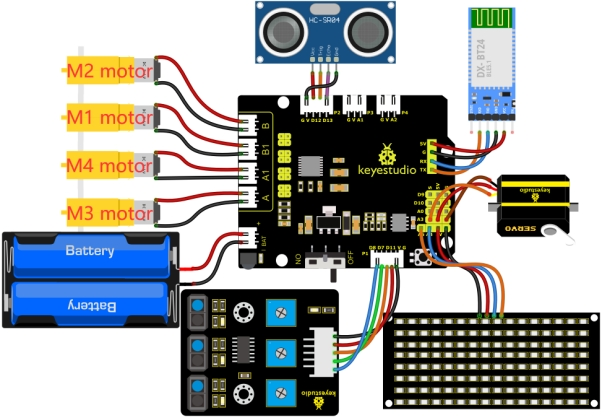

M2 Motor is connected to B interface,，M3 Motor is connected to A interface.

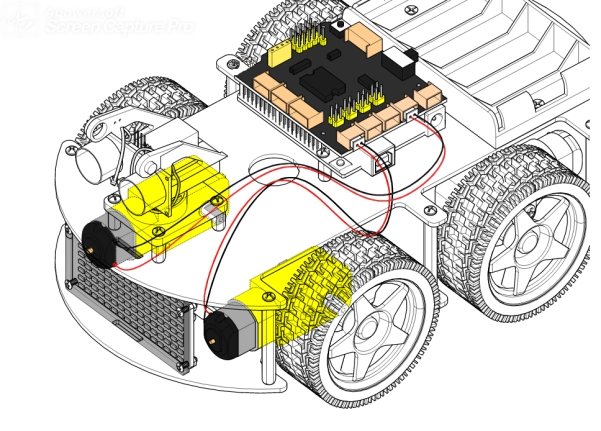

M1 Motor is connected to B1 interface，M4 Motor is connected to A1 interface.

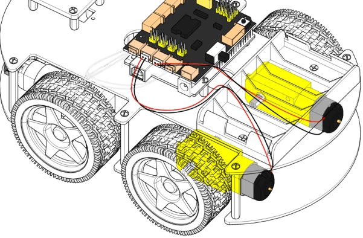

The wiring of the 3-channel line-tracking sensor

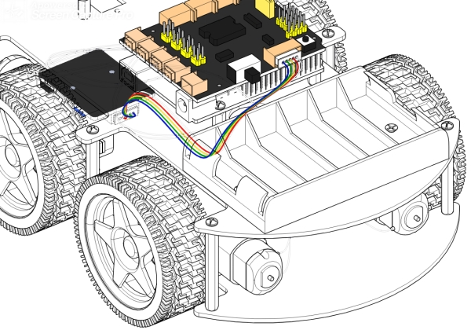

The power supply is connected to BAT

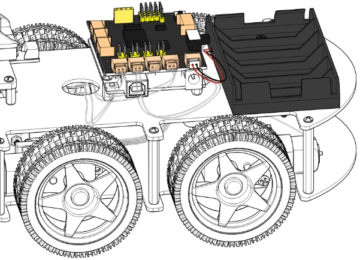

The wiring of the ultrasonic sensor

| Ultrasonic Sensor | 8833 Motor Driver Expansion Board |
| ----------------- | --------------------------------- |
| Vcc               | V                                 |
| Trig              | D12                               |
| Echo              | D13                               |
| Gnd               | G                                 |

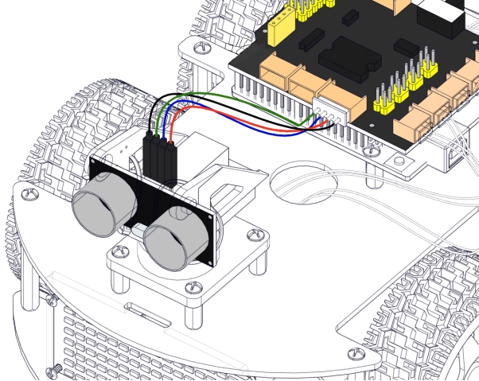

The wiring of the 8*16 LED Board

| 8*16 LED Board | 8833 Motor Driver Expansion Board |
| -------------- | --------------------------------- |
| GND            | G                                 |
| VCC            | 5V                                |
| SDA            | A4                                |
| SCL            | A5                                |

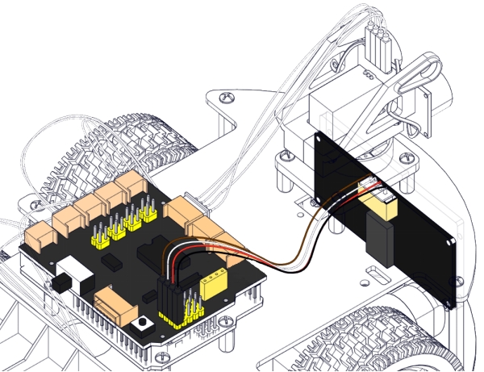

The wiring of the servo

| Servo  | 8833 Motor Driver Expansion Board |
| ------ | --------------------------------- |
| Brown  | G                                 |
| Red    | 5V                                |
| Yellow | A3                                |

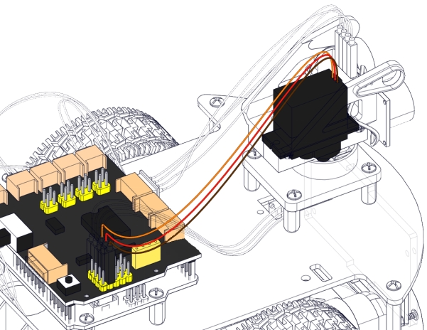

Plug in the Bluetooth module and jumper caps

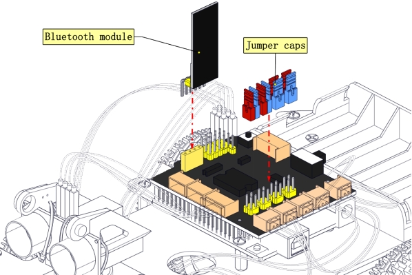

**Complete Prototype**

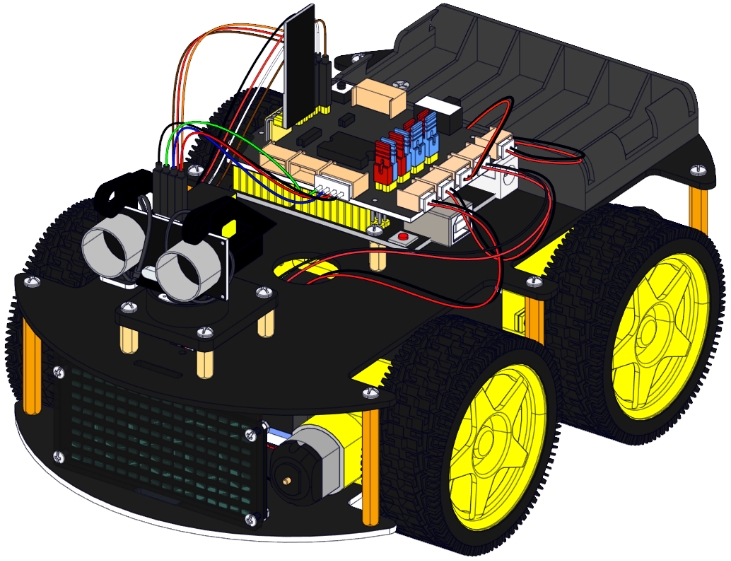


