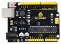
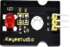
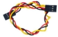

# Project 1: LED Blink

**1. Description**


For starters and enthusiasts, LED Blink is a fundamental program. LED, the abbreviation of light emitting diodes, consists of Ga, As, P, N chemical compounds and so on. 

The LED can flash in diverse color by altering the delay time in the test code. When in control, power on GND and VCC, the LED will be on if S end is in high level, otherwise it will go off.


**2.Specification**


  - Control interface: digital port
  - Working voltage: DC 3.3-5V
  - Pin spacing: 2.54mm
  - LED display color: red


**3.Components**

| 4.0 Development Board *1                                     | 8833 Motor Driver Expansion Board *1                         | Red LED Module*1                                             |
| ------------------------------------------------------------ | ------------------------------------------------------------ | ------------------------------------------------------------ |
|  |  |  |
| **3P F-F Dupont Wire*1**                                     | **USB Cable*1**                                              |                                                              |
|                                      |                     |                                                              |

**4.Wiring Diagram**


As can be seen from the above figure, the Keyestudio 8833 motor driver expansion board is stacked on the Keyestudio 4.0 development board. 

The pin G, V and S of the LED module are connected to G, 5V and D9 of the expansion board respectively.


**5.Test Code**

```c
//****************************************************************************
/*
 keyestudio 4wd BT Car
 lesson 1.1
 Blink
 http://www.keyestudio.com
*/
void setup()
{ 
  pinMode(9, OUTPUT);// initialize digital pin 9 as an output.
}

void loop() // the loop function runs over and over again forever
{  
  digitalWrite(9, HIGH); // turn the LED on (HIGH is the voltage level)
  delay(1000); // wait for a second
  digitalWrite(9, LOW); // turn the LED off by making the voltage LOW
  delay(1000); // wait for a second
}
//****************************************************************************
```

**6.Test Result**

After successfully uploading the code to the V4.0 board, connect the wirings according to the wiring diagram, and use a USB cable to connect the computer to power the board. After powering on, you will see the LED connected to the D9 will be on and off. 


**7.Code Explanation**

**pinMode(9，OUTPUT) **- This function can denote that the pin is INPUT or OUTPUT

**digitalWrite(9，HIGH)** - When pin is OUTPUT, we can set it to HIGH(output 5V) or LOW(output 0V)


**8.Extension Practice**

We have succeeded in blinking LED. Next, let’s observe what will happen to the LED if we modify the delay time.

```c
//****************************************************************************
/*
 keyestudio 4wd BT Car
 lesson 1.2
 delay
 http://www.keyestudio.com
*/
void setup()
{  
  // initialize digital pin 11 as an output.
  pinMode(9, OUTPUT);
}
// the loop function runs over and over again forever
void loop()
{ 
  digitalWrite(9, HIGH); // turn the LED on (HIGH is the voltage level)
  delay(100); // wait for 0.1 second
  digitalWrite(9, LOW); // turn the LED off by making the voltage LOW
  delay(100); // wait for 0.1 second
}
//*****************************************************************
```


The test result shows that the LED flashes faster. Therefore, the delaying time enables to affect the flash frequency of the LED.
