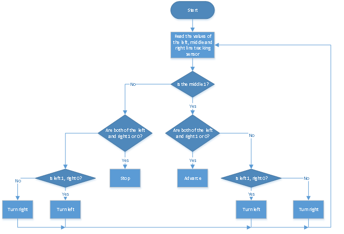

# **Project 11 Line Tracking Smart Car**


**1.Description**

Based on the working principle of the line tracking sensor, we empower to make a line tracking smart car. 

In this project, we detect whether there is a black line at the bottom of the smart car through a line tracking sensor, and then control the rotation of the two groups of motors according to the detection results in a way that control the smart car to walk along the black line. 


**2.Flow Chart**



| Detection       |                                                              |                                                       |
| --------------- | ------------------------------------------------------------ | ----------------------------------------------------- |
|                 | Middle tracking sensor                                       | detects black line: HIGH<br />detects white line: LOW |
|                 | Left tracking sensor                                         | detects black line: HIGH<br />detects white line: LOW |
|                 | Right tracking sensor                                        | detects black line: HIGH<br />detects white line: LOW |
|                 |                                                              |                                                       |
|                 | **Condition**                                                | **Status**                                            |
| **Condition 1** | Middle tracking sensor detects **black** line                |                                                       |
| **Condition 2** | Detect the left and the right tracking sensor                |                                                       |
|                 | left tracking sensor detects black line; right sensor detects white line | Turn left                                             |
|                 | left tracking sensor detects white line; right sensor detects black line | Turn right                                            |
|                 | left and right tracking sensor detect black line             | Advance                                               |
|                 | left and right tracking sensor detect white line             | Advance                                               |
|                 |                                                              |                                                       |
| **Condition 1** | Middle tracking sensor detects **white** line                |                                                       |
| **Condition 2** | left tracking sensor detects black line; right sensor detects white line | Turn left                                             |
|                 | left tracking sensor detects white line; right sensor detects black line | Turn right                                            |
|                 | left and right tracking sensor detect black line             | Stop                                                  |
|                 | left and right tracking sensor detect white line             | Stop                                                  |

**3.Wiring Diagram**


G, V, S1, S2 and S3 of the line tracking sensor are connected to G（GND), V（VCC), D11, D7 and D8 of the sensor expansion board.

The power is connected to the BAT port.


**4.Test Code**

```c
//*************************************************************************
/*
 keyestudio 4wd BT Car
 lesson 11
 Tracking Car
 http://www.keyestudio.com
*/ 
//Data from the smile pattern obtained from the touch tool
unsigned char start01[] = {0x01, 0x02, 0x04, 0x08, 0x10, 0x20, 0x40, 0x80, 0x80, 0x40, 0x20, 0x10, 0x08, 0x04, 0x02, 0x01};
#define SDA_Pin  A4  //Set data pin to A4
#define SCL_Pin  A5  //Set the clock pin to A5

int left_ctrl = 2;//define the direction control pins of group B motor
int left_pwm = 5;//define the PWM control pins of group B motor
int right_ctrl = 4;//define the direction control pins of group A motor
int right_pwm = 6;//define the PWM control pins of group A motor
int sensor_L = 11;//define the pin of left line tracking sensor
int sensor_M = 7;//define the pin of middle line tracking sensor
int sensor_R = 8;//define the pin of right line tracking sensor
int L_val,M_val,R_val;//define these variables

void setup() {
  Serial.begin(9600);//start serial monitor and set baud rate to 9600
  pinMode(left_ctrl,OUTPUT);//set direction control pins of group B motor to OUTPUT
  pinMode(left_pwm,OUTPUT);//set PWM control pins of group B motor to OUTPUT
  pinMode(right_ctrl,OUTPUT);//set direction control pins of group A motor to OUTPUT
  pinMode(right_pwm,OUTPUT);//set PWM control pins of group A motor to OUTPUT
  pinMode(sensor_L,INPUT);//set the pins of left line tracking sensor to INPUT
  pinMode(sensor_M,INPUT);//set the pins of middle line tracking sensor to INPUT
  pinMode(sensor_R,INPUT);//set the pins of right line tracking sensor to INPUT
  //Set pin to output
  pinMode(SCL_Pin, OUTPUT);
  pinMode(SDA_Pin, OUTPUT);
  matrix_display(start01);//Show start pattern
}

void loop() 
{
  tracking(); //run main program
}

void tracking()
{
  L_val = digitalRead(sensor_L);//read the value of left line tracking sensor
  M_val = digitalRead(sensor_M);//read the value of middle line tracking sensor
  R_val = digitalRead(sensor_R);//read the value of right line tracking sensor

  if(M_val == 1){//if the state of middle one is 1, which means detecting black line

     if (L_val == 1 && R_val == 0) { //If a black line is detected on the left, but not on the right, turn left
        left();
    }
     else if (L_val == 0 && R_val == 1) { //Otherwise, if a black line is detected on the right and not on the left, turn right
      right();
    }
     else { //Otherwise,forward
      front();
    }
  }
  else { //No black lines detected in the middle
    if (L_val == 1 && R_val == 0) { //If a black line is detected on the left, but not on the right, turn left
      left();
    }
    else if (L_val == 0 && R_val == 1) { //Otherwise, if a black line is detected on the right and not on the left, turn right
      right();
    }
    else { //Otherwise,stop
      Stop();
    }
  }
}
void front()//define the status of going forward
{
  digitalWrite(left_ctrl,HIGH);
  analogWrite(left_pwm,155);
  digitalWrite(right_ctrl,HIGH);
  analogWrite(right_pwm,155);
}
void back()//define the state of going back
{
  digitalWrite(left_ctrl,LOW);
  analogWrite(left_pwm,100);
  digitalWrite(right_ctrl,LOW);
  analogWrite(right_pwm,100);
}
void left()//define the left-turning state
{
  digitalWrite(left_ctrl, LOW);
  analogWrite(left_pwm, 100);  
  digitalWrite(right_ctrl, HIGH);
  analogWrite(right_pwm, 155);
}
void right()//define the right-turning state
{
  digitalWrite(left_ctrl, HIGH);
  analogWrite(left_pwm, 155);
  digitalWrite(right_ctrl, LOW);
  analogWrite(right_pwm, 100);
}
void Stop()//define the state of stop
{
  digitalWrite(left_ctrl, LOW);
  analogWrite(left_pwm,0);
  digitalWrite(right_ctrl, LOW);
  analogWrite(right_pwm,0);
}

//this function is used for dot matrix display
void matrix_display(unsigned char matrix_value[])
{
  IIC_start();  //the function that calls the data transfer start condition
  IIC_send(0xc0);  //select address

  for (int i = 0; i < 16; i++) //the pattern data is 16 bytes
  {
    IIC_send(matrix_value[i]); //Transmit the data of the pattern
  }
  IIC_end();   //End pattern data transmission
  IIC_start();
  IIC_send(0x8A);  //Display control, select 4/16 pulse width
  IIC_end();
}
//Conditions under which data transmission begins
void IIC_start()
{
  digitalWrite(SDA_Pin, HIGH);
  digitalWrite(SCL_Pin, HIGH);
  delayMicroseconds(3);
  digitalWrite(SDA_Pin, LOW);
  delayMicroseconds(3);
  digitalWrite(SCL_Pin, LOW);
}
//Indicates the end of data transmission
void IIC_end()
{
  digitalWrite(SCL_Pin, LOW);
  digitalWrite(SDA_Pin, LOW);
  delayMicroseconds(3);
  digitalWrite(SCL_Pin, HIGH);
  delayMicroseconds(3);
  digitalWrite(SDA_Pin, HIGH);
  delayMicroseconds(3);
}
//transmit data
void IIC_send(unsigned char send_data)
{
  for (byte mask = 0x01; mask != 0; mask <<= 1) //Each byte has 8 bits and is checked bit by bit starting at the lowest level
  {
    if (send_data & mask) { //Sets the high and low levels of SDA_Pin depending on whether each bit of the byte is a 1 or a 0
      digitalWrite(SDA_Pin, HIGH);
    } else {
      digitalWrite(SDA_Pin, LOW);
    }
    delayMicroseconds(3);
    digitalWrite(SCL_Pin, HIGH); //Pull the clock pin SCL_Pin high to stop data transmission
    delayMicroseconds(3);
    digitalWrite(SCL_Pin, LOW); //pull the clock pin SCL_Pin low to change the SIGNAL of SDA 
  }
}
//*************************************************************************
```


**5.Test Result**

After successfully uploading the code to the V4.0 board, connect the wirings according to the wiring diagram, power on the external power then turn the DIP switch to ON. Then the smart car will walk along the lines.


