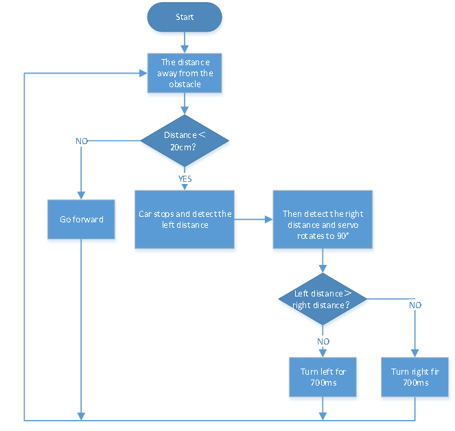

# Project 13 Ultrasonic Obstacle Avoidance Smart Car


**1.Description**

In this project, we aim to make an ultrasonic obstacle avoidance smart car. 

We will use the ultrasonic to detect the distance from the obstacle, which can be used to control the servo to rotate so as to make the car move. Meanwhile, the 8X16 LED board will display the corresponding status pattern.


**2.Flow Chart**



**The specific logic of ultrasonic obstacle avoidance smart car is shown below:**

|        Detection         |                                       |                                                              |
| :----------------------: | :-----------------------------------: | ------------------------------------------------------------ |
| distance<br />(unit: cm) |           set servo to 90°            | measured distance of front obstacle                          |
|    a1<br />(unit: cm)    |           set servo to 160°           | measured distance of left obstacle                           |
|    a2<br />(unit: cm)    |           set servo to 20°            | measured distance of right obstacle                          |
|       **Setting**        | set the initial angle of servo to 90° |                                                              |
|                          |             **Condition**             | **Status**                                                   |
|      **Condition1**      |                 a＜20                 | Stop for 1000ms<br />set the angle of servo to 160°, read a1, delay in 500ms<br />set the angle of servo to 20°, read a2, delay in 500ms |
|     **Condition 2**      |           a1＜50 or a2＜50            | Compare a1 and a2                                            |
|     **Condition 3**      |                a1＞a2                 | Set the angle of servo to 90°，rotate to left for 700ms and go front |
|                          |                a1＜a2                 | Set the angle of servo to 90°，rotate to right for 700ms, go front |
|                          |                                       |                                                              |
|      **Condition1**      |                 a＜20                 |                                                              |
|     **Condition 2**      |            a1≥50 and a2≥50            | Random:<br />Set the angle of servo to 90°，rotate to left for 700ms and go front<br />Set the angle of servo to 90°，rotate to right for 700ms, go front |
|                          |                                       |                                                              |
|     **Condition 1**      |                 a≥20                  | Go forward                                                   |


**3.Wiring Diagram**


1\. GND, VCC, SDA and SCL of the 8\*8 LED board module are connected to G（GND), V（VCC), A4 and A5 of the expansion board.

2\. VCC, Trig, Echo and Gnd of the ultrasonic sensor are connected to 5V(V), D12(S), D13(S) and Gnd(G)

3\. The servo is connected to G, V and A3. The brown wire is interfacedwith Gnd(G), the red wire is interfaced with 5V(V) and the orange wire is interfaced with A3.

4\. The power is connected to the BAT port


**4.Test Code**

```c
//*******************************************************************************
/*
 keyestudio 4wd BT Car
 lesson 13
 Avoiding Car
 http://www.keyestudio.com
*/ 
#define SCL_Pin  A5  //Set the clock pin to A5
#define SDA_Pin  A4  //Set data pin to A4
//Array, used to store the data of pattern, can be calculated by yourself or obtained from the modulus tool
unsigned char front[] = {0x00,0x00,0x00,0x00,0x00,0x24,0x12,0x09,0x12,0x24,0x00,0x00,0x00,0x00,0x00,0x00};
unsigned char left[] = {0x00,0x00,0x00,0x00,0x00,0x00,0x44,0x28,0x10,0x44,0x28,0x10,0x44,0x28,0x10,0x00};
unsigned char right[] = {0x00,0x10,0x28,0x44,0x10,0x28,0x44,0x10,0x28,0x44,0x00,0x00,0x00,0x00,0x00,0x00};
unsigned char STOP01[] = {0x2E,0x2A,0x3A,0x00,0x02,0x3E,0x02,0x00,0x3E,0x22,0x3E,0x00,0x3E,0x0A,0x0E,0x00};
unsigned char clear[] = {0x00,0x00,0x00,0x00,0x00,0x00,0x00,0x00,0x00,0x00,0x00,0x00,0x00,0x00,0x00,0x00};

int left_ctrl = 2;//define the direction control pins of group B motor
int left_pwm = 5;//define the PWM control pins of group B motor
int right_ctrl = 4;//define the direction control pins of group A motor
int right_pwm = 6;//define the PWM control pins of group A motor

#include "SR04.h"//define the library of ultrasonic sensor
#define TRIG_PIN 12// set the signal output of ultrasonic sensor to D12 
#define ECHO_PIN 13//set the signal input of ultrasonic sensor to D13 
SR04 sr04 = SR04(ECHO_PIN,TRIG_PIN);
long distance,a1,a2;//define three distance
const int servopin = A3;//set the pin of servo to A3 

void setup() {
  pinMode(left_ctrl,OUTPUT);//set direction control pins of group B motor to OUTPUT
  pinMode(left_pwm,OUTPUT);//set PWM control pins of group B motor to OUTPUT
  pinMode(right_ctrl,OUTPUT);//set direction control pins of group A motor to OUTPUT
  pinMode(right_pwm,OUTPUT);//set PWM control pins of group A motor to OUTPUT
  pinMode(TRIG_PIN, OUTPUT); //Set the trig pin to output
  pinMode(ECHO_PIN, INPUT); //Set the echo pin to input
  servopulse(servopin,90);//the angle of servo is 90 degree
  delay(300);
  pinMode(SCL_Pin,OUTPUT);// Set the clock pin to output
  pinMode(SDA_Pin,OUTPUT);//Set the data pin to output
  matrix_display(clear);
}
 
void loop()
 {
  avoid();//run the main program
}

void avoid()
{
  distance=sr04.Distance(); //obtain the value detected by ultrasonic sensor 

  if((distance < 20)&&(distance != 0))//if the distance is greater than 0 and less than 10  

  {
    car_Stop();//stop
    matrix_display(clear);
    matrix_display(STOP01);//show stop pattern
    delay(1000);
    servopulse(servopin,160);//servo rotates to 160°
    delay(500);
    a1=sr04.Distance();//measure the distance
    delay(100);
    servopulse(servopin,20);//rotate to 20 degree
    delay(500);
    a2=sr04.Distance();//measure the distance
    delay(100);
    servopulse(servopin,90);  //Return to the 90 degree position
    delay(500);
    if(a1 > a2)//compare the distance, if left distance is more than right distance
    {
      car_left();//turn left
      matrix_display(clear);
      matrix_display(left);    //display left-turning pattern
      servopulse(servopin,90);//servo rotates to 90 degree
      delay(700); //turn left 700ms
      matrix_display(clear);
      matrix_display(front);  //show forward pattern
    }
    else//if the right distance is greater than the left
    {
      car_right();//turn right
      matrix_display(clear);
      matrix_display(right);  //display right-turning pattern
      servopulse(servopin,90);//servo rotates to 90 degree
      delay(700);
      matrix_display(clear);
      matrix_display(front);  //show forward pattern
    }
  }
  else//otherwise
  {
    car_front();//go forward
    matrix_display(clear);
    matrix_display(front);  // show forward pattern
  }
}

void car_front()//car goes forward
{
  digitalWrite(left_ctrl,HIGH);
  analogWrite(left_pwm,155);
  digitalWrite(right_ctrl,HIGH);
  analogWrite(right_pwm,155);
}
void car_back()//go back
{
  digitalWrite(left_ctrl,LOW);
  analogWrite(left_pwm,100);
  digitalWrite(right_ctrl,LOW);
  analogWrite(right_pwm,100);
}
void car_left()//car turns left
{
  digitalWrite(left_ctrl, LOW);
  analogWrite(left_pwm, 100);  
  digitalWrite(right_ctrl, HIGH);
  analogWrite(right_pwm, 155);
}
void car_right()//car turns right
{
  digitalWrite(left_ctrl, HIGH);
  analogWrite(left_pwm, 155);
  digitalWrite(right_ctrl, LOW);
  analogWrite(right_pwm, 100);
}
void car_Stop()//stop
{
  digitalWrite(left_ctrl,LOW);
  analogWrite(left_pwm,0);
  digitalWrite(right_ctrl,LOW);
  analogWrite(right_pwm,0);
}

void servopulse(int servopin,int myangle)//the running angle of servo
{
  for(int i=0; i<20; i++)
  {
    int pulsewidth = (myangle*11)+500;
    digitalWrite(servopin,HIGH);
    delayMicroseconds(pulsewidth);
    digitalWrite(servopin,LOW);
    delay(20-pulsewidth/1000);
  } 
}

//this function is used for dot matrix display
void matrix_display(unsigned char matrix_value[])
{
  IIC_start();  //the function that calls the data transfer start condition
  IIC_send(0xc0);  //select address

  for (int i = 0; i < 16; i++) //the pattern data is 16 bytes
  {
    IIC_send(matrix_value[i]); //Transmit the data of the pattern
  }
  IIC_end();   //End pattern data transmission
  IIC_start();
  IIC_send(0x8A);  //Display control, select 4/16 pulse width
  IIC_end();
}
//Conditions under which data transmission begins
void IIC_start()
{
  digitalWrite(SDA_Pin, HIGH);
  digitalWrite(SCL_Pin, HIGH);
  delayMicroseconds(3);
  digitalWrite(SDA_Pin, LOW);
  delayMicroseconds(3);
  digitalWrite(SCL_Pin, LOW);
}
//Indicates the end of data transmission
void IIC_end()
{
  digitalWrite(SCL_Pin, LOW);
  digitalWrite(SDA_Pin, LOW);
  delayMicroseconds(3);
  digitalWrite(SCL_Pin, HIGH);
  delayMicroseconds(3);
  digitalWrite(SDA_Pin, HIGH);
  delayMicroseconds(3);
}
//transmit data
void IIC_send(unsigned char send_data)
{
  for (byte mask = 0x01; mask != 0; mask <<= 1) //Each byte has 8 bits and is checked bit by bit starting at the lowest level
  {
    if (send_data & mask) { //Sets the high and low levels of SDA_Pin depending on whether each bit of the byte is a 1 or a 0
      digitalWrite(SDA_Pin, HIGH);
    } else {
      digitalWrite(SDA_Pin, LOW);
    }
    delayMicroseconds(3);
    digitalWrite(SCL_Pin, HIGH); //Pull the clock pin SCL_Pin high to stop data transmission
    delayMicroseconds(3);
    digitalWrite(SCL_Pin, LOW); //pull the clock pin SCL_Pin low to change the SIGNAL of SDA 
  }
}
//*******************************************************************************
```


**5.Test Result**

After successfully uploading the code to the V4.0 board, connect the wirings according to the wiring diagram, power on the external power then turn the DIP switch to ON. 

The smart car moves forward and automatically avoids obstacles. When there is no road ahead, the servo will drive the ultrasonic sensor to scan the left, middle and right distances, and the car will turn to the open side. 

Meanwhile, the 8X16 LED board will display the corresponding status pattern.


