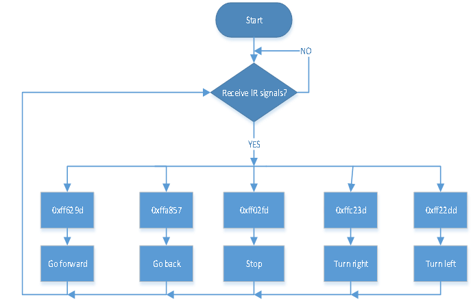

# Project 14 IR Remote Control Smart Car


**1.Description**

In this project, we will make an IR remote control smart car and press the button on the IR remote control to drive the car to move.


**2.Flow Chart**



**The specific logic of IR remote control smart car is shown below:**

| Initial setup                                                | LED board displays smile face |                                                         |
| ------------------------------------------------------------ | ----------------------------- | ------------------------------------------------------- |
| **Remote control**                                           | **Key value**                 | **Key state**                                           |
|  | FF629D                        | Go front<br />8x8 LED board shows front icon            |
|  | FFA857                        | Go back<br />8x8 LED board shows back icon              |
|  | FF22DD                        | Rotate to left<br />8x8 LED board shows leftward icon   |
|  | FFC23D                        | Rotate to right<br />8x8 LED board shows rightward icon |
|  | FF02FD                        | Stop<br />8x8 LED board shows“STOP”                     |


**3.Wiring Diagram**


1.  GND, VCC, SDA and SCL of the 8\*8 LED board module are connected to G（GND), V（VCC), A4 and A5 of the expansion board.
2.  As the IR receiver is integrated on the 8833 motor driver expansion board, there is no need for additional wiring. The pins of the IR receiver on the 8833 board are G (GND), V (VCC) and D3 respectively. 
3.  The servo is connected to G, V and A3. The brown wire is interfaced with Gnd(G), the red wire is interfaced with 5V(V) and the orange wire is interfaced with A3.
4.  The power is connected to the BAT port


**4.Test Code**

```c
//*******************************************************************************
/*
keyestudio 4wd BT Car 
lesson 14
IR remote Control Car
http://www.keyestudio.com
*/ 
#define SCL_Pin  A5  //Set the clock pin to A5
#define SDA_Pin  A4  //Set data pin to A4
//Array, used to store the data of pattern, can be calculated by yourself or obtained from the modulus tool
unsigned char start01[] = {0x01,0x02,0x04,0x08,0x10,0x20,0x40,0x80,0x80,0x40,0x20,0x10,0x08,0x04,0x02,0x01};
unsigned char front[] = {0x00,0x00,0x00,0x00,0x00,0x24,0x12,0x09,0x12,0x24,0x00,0x00,0x00,0x00,0x00,0x00};
unsigned char back[] = {0x00,0x00,0x00,0x00,0x00,0x24,0x48,0x90,0x48,0x24,0x00,0x00,0x00,0x00,0x00,0x00};
unsigned char left[] = {0x00,0x00,0x00,0x00,0x00,0x00,0x44,0x28,0x10,0x44,0x28,0x10,0x44,0x28,0x10,0x00};
unsigned char right[] = {0x00,0x10,0x28,0x44,0x10,0x28,0x44,0x10,0x28,0x44,0x00,0x00,0x00,0x00,0x00,0x00};
unsigned char STOP01[] = {0x2E,0x2A,0x3A,0x00,0x02,0x3E,0x02,0x00,0x3E,0x22,0x3E,0x00,0x3E,0x0A,0x0E,0x00};
unsigned char clear[] = {0x00,0x00,0x00,0x00,0x00,0x00,0x00,0x00,0x00,0x00,0x00,0x00,0x00,0x00,0x00,0x00};

#include <Arduino.h>
#include <IRremote.h>//function library of IR remote control
int RECV_PIN = 3;//set the pin of IR receiver to D3
IRrecv irrecv(RECV_PIN);
long irr_val;
decode_results results;

int left_ctrl = 2;//define the direction control pins of group B motor
int left_pwm = 5;//define the PWM control pins of group B motor
int right_ctrl = 4;//define the direction control pins of group A motor
int right_pwm = 6;//define the PWM control pins of group A motor

#include <Servo.h>
Servo servo_A3;//set the pin of servo to A3 

unsigned char data_line = 0;
unsigned char delay_count = 0;

void setup() {
  Serial.begin(9600);//
  // In case the interrupt driver crashes on setup, give a clue
  // to the user what's going on.
  Serial.println("Enabling IRin");
  irrecv.enableIRIn(); // Start the receiver
  Serial.println("Enabled IRin");
  pinMode(left_ctrl,OUTPUT);//set direction control pins of group B motor to OUTPUT
  pinMode(left_pwm,OUTPUT);//set PWM control pins of group B motor to OUTPUT
  pinMode(right_ctrl,OUTPUT);//set direction control pins of group A motor to OUTPUT
  pinMode(right_pwm,OUTPUT);//set PWM control pins of group A motor to OUTPUT
  servo_A3.attach(A3);
  servo_A3.write(90);//the angle of servo is 90 degree
  delay(300);
  pinMode(SCL_Pin,OUTPUT);// Set the clock pin to output
  pinMode(SDA_Pin,OUTPUT);//Set the data pin to output
  matrix_display(clear);
  matrix_display(start01); //display start01 expression pattern
}

void loop()
 {
  if (irrecv.decode(&results)) 
 {
    irr_val = results.value;
    Serial.println(irr_val, HEX);//serial prints the read IR remote signals 
    switch(irr_val)
    {
      case 0xFF629D : car_front(); //Receive 0xFF629D,the car goes forward
      matrix_display(clear);
      matrix_display(front);   
      break;
      
      case 0xFFA857 : car_back(); //Receive 0xFFA857,the car goes back
      matrix_display(clear);
      matrix_display(back); 
      break;

      case 0xFF22DD : car_left(); //Receive 0xFF22DD,the car left rotates
      matrix_display(clear);
      matrix_display(left); 
      break;
     
      case 0xFFC23D : car_right();//Receive 0xFFC23D,the car right rotates
      matrix_display(clear);
      matrix_display(right);  
      break;
     
      case 0xFF02FD : car_Stop();//Receive 0xFF02FD,the car stops
      matrix_display(clear);
      matrix_display(STOP01); 
      break;
    }
        irrecv.resume(); // Receive the next value
  }
}

void car_front()//define the state of going front
{
  digitalWrite(left_ctrl,HIGH);
  analogWrite(left_pwm,105);
  digitalWrite(right_ctrl,HIGH);
  analogWrite(right_pwm,105);
}
void car_back()//define the status of going back
{
  digitalWrite(left_ctrl,LOW);
  analogWrite(left_pwm,150);
  digitalWrite(right_ctrl,LOW);
  analogWrite(right_pwm,150);
}
void car_left()//set the status of left turning
{
  digitalWrite(left_ctrl, LOW);
  analogWrite(left_pwm, 100);  
  digitalWrite(right_ctrl, HIGH);
  analogWrite(right_pwm, 155);
}
void car_right()//set the status of right turning
{
  digitalWrite(left_ctrl, HIGH);
  analogWrite(left_pwm, 155);
  digitalWrite(right_ctrl, LOW);
  analogWrite(right_pwm, 100);
}
void car_Stop()//define the state of stop
{
  digitalWrite(left_ctrl,LOW);
  analogWrite(left_pwm,0);
  digitalWrite(right_ctrl,LOW);
  analogWrite(right_pwm,0);
}

//this function is used for dot matrix display
void matrix_display(unsigned char matrix_value[])
{
  IIC_start();  //the function that calls the data transfer start condition
  IIC_send(0xc0);  //select address

  for (int i = 0; i < 16; i++) //the pattern data is 16 bytes
  {
    IIC_send(matrix_value[i]); //Transmit the data of the pattern
  }
  IIC_end();   //End pattern data transmission
  IIC_start();
  IIC_send(0x8A);  //Display control, select 4/16 pulse width
  IIC_end();
}
//Conditions under which data transmission begins
void IIC_start()
{
  digitalWrite(SDA_Pin, HIGH);
  digitalWrite(SCL_Pin, HIGH);
  delayMicroseconds(3);
  digitalWrite(SDA_Pin, LOW);
  delayMicroseconds(3);
  digitalWrite(SCL_Pin, LOW);
}
//Indicates the end of data transmission
void IIC_end()
{
  digitalWrite(SCL_Pin, LOW);
  digitalWrite(SDA_Pin, LOW);
  delayMicroseconds(3);
  digitalWrite(SCL_Pin, HIGH);
  delayMicroseconds(3);
  digitalWrite(SDA_Pin, HIGH);
  delayMicroseconds(3);
}
//transmit data
void IIC_send(unsigned char send_data)
{
  for (byte mask = 0x01; mask != 0; mask <<= 1) //Each byte has 8 bits and is checked bit by bit starting at the lowest level
  {
    if (send_data & mask) { //Sets the high and low levels of SDA_Pin depending on whether each bit of the byte is a 1 or a 0
      digitalWrite(SDA_Pin, HIGH);
    } else {
      digitalWrite(SDA_Pin, LOW);
    }
    delayMicroseconds(3);
    digitalWrite(SCL_Pin, HIGH); //Pull the clock pin SCL_Pin high to stop data transmission
    delayMicroseconds(3);
    digitalWrite(SCL_Pin, LOW); //pull the clock pin SCL_Pin low to change the SIGNAL of SDA 
  }
}
//*******************************************************************************
```


**5.Test Result**

After successfully uploading the code to the V4.0 board, connect the wirings according to the wiring diagram, power on the external power then turn the DIP switch to ON. 

Then we enable to use the IR remote control drive the car to move to and the 8X16 LED board will display the corresponding status pattern.
