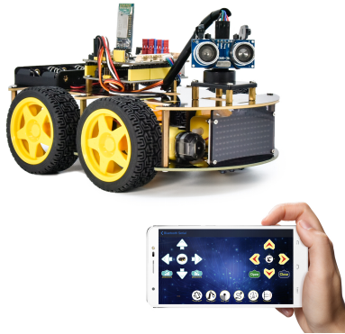

# Project 16 Bluetooth Speed Control Smart Car



**1.Description**

In this project, we will use a Bluetooth to adjust the speed of the smart car. We empower to define a variable speeds and change it to change the speed of the smart car. 


**2.Flow Chart**


**3.Wiring Diagram**


1. GND, VCC, SDA and SCL of the 8*8 LED board are connected to G（GND), V（VCC), A4 and A5 of the expansion board.

2. The RXD, TXD, GND and VCC of the Bluetooth module are respectively connected to TX, RX, G and 5V on the 8833 motor driver expansion board, while the STATE and BRK pins of the Bluetooth module do not need to be connected. 

3. The servo is connected to G, V and A3. The brown wire is interfaced with GND(G), the red wire is interfaced with 5V(V) and the orange wire is interfaced with A3.

4. The power is connected to the BAT port.


**4.Test Code**

```c
//*******************************************************************************
/*
keyestudio 4wd BT Car 
lesson 16
Bluetooth Speed Control Car
http://www.keyestudio.com
*/ 
#define SCL_Pin  A5  //Set the clock pin to A5
#define SDA_Pin  A4  //Set data pin to A4
//Array, used to store the data of pattern, can be calculated by yourself or obtained from the modulus tool
unsigned char start01[] = {0x01,0x02,0x04,0x08,0x10,0x20,0x40,0x80,0x80,0x40,0x20,0x10,0x08,0x04,0x02,0x01};
unsigned char front[] = {0x00,0x00,0x00,0x00,0x00,0x24,0x12,0x09,0x12,0x24,0x00,0x00,0x00,0x00,0x00,0x00};
unsigned char back[] = {0x00,0x00,0x00,0x00,0x00,0x24,0x48,0x90,0x48,0x24,0x00,0x00,0x00,0x00,0x00,0x00};
unsigned char left[] = {0x00,0x00,0x00,0x00,0x00,0x00,0x44,0x28,0x10,0x44,0x28,0x10,0x44,0x28,0x10,0x00};
unsigned char right[] = {0x00,0x10,0x28,0x44,0x10,0x28,0x44,0x10,0x28,0x44,0x00,0x00,0x00,0x00,0x00,0x00};
unsigned char STOP01[] = {0x2E,0x2A,0x3A,0x00,0x02,0x3E,0x02,0x00,0x3E,0x22,0x3E,0x00,0x3E,0x0A,0x0E,0x00};
unsigned char clear[] = {0x00,0x00,0x00,0x00,0x00,0x00,0x00,0x00,0x00,0x00,0x00,0x00,0x00,0x00,0x00,0x00};
unsigned char speed_a[] = 
{0x00,0x40,0x20,0x10,0x08,0x04,0x02,0xff,0x02,0x04,0x08,0x10,0x20,0x40,0x00,0x00};
unsigned char speed_d[] = 
{0x00,0x02,0x04,0x08,0x10,0x20,0x40,0xff,0x40,0x20,0x10,0x08,0x04,0x02,0x00,0x00};

int left_ctrl = 2;//define the direction control pins of group B motor
int left_pwm = 5;//define the PWM control pins of group B motor
int right_ctrl = 4;//define the direction control pins of group A motor
int right_pwm = 6;//define the PWM control pins of group A motor

int speeds = 150; //Set the initial speed to 150

const int servopin = A3;//set the pin of servo to A3 

char BLE_val;

void setup() {
  Serial.begin(9600);//
  pinMode(left_ctrl,OUTPUT);//set direction control pins of group B motor to OUTPUT
  pinMode(left_pwm,OUTPUT);//set PWM control pins of group B motor to OUTPUT
  pinMode(right_ctrl,OUTPUT);//set direction control pins of group A motor to OUTPUT
  pinMode(right_pwm,OUTPUT);//set PWM control pins of group A motor to OUTPUT
  servopulse(servopin,90);//the angle of servo is 90 degree
  delay(300);
  pinMode(SCL_Pin,OUTPUT);// Set the clock pin to output
  pinMode(SDA_Pin,OUTPUT);//Set the data pin to output
  matrix_display(clear);
  matrix_display(start01); //display start01 expression pattern
}

void loop() {
   if(Serial.available()>0) {
    BLE_val = Serial.read();
    Serial.println(BLE_val);
  } 
    switch(BLE_val)
    {
      case 'F' : car_front(); 
      matrix_display(clear);
      matrix_display(front);   
      break;
      
      case 'B' : car_back(); 
      matrix_display(clear);
      matrix_display(back); 
      break;

      case 'L' : car_left(); 
      matrix_display(clear);
      matrix_display(left); 
      break;
     
      case 'R' : car_right();
      matrix_display(clear);
      matrix_display(right);  
      break;
     
      case 'S' : car_Stop();
      matrix_display(clear);
      matrix_display(STOP01); 
      break;

      case 'a' : speeds_a();
      matrix_display(clear);
      matrix_display(speed_a);  
      break;
     
      case 'd' : speeds_d();
      matrix_display(clear);
      matrix_display(speed_d); 
      break;
    }
}

void car_front()//define the state of going front
{
  digitalWrite(left_ctrl,HIGH);
  analogWrite(left_pwm,(255-speeds));
  digitalWrite(right_ctrl,HIGH);
  analogWrite(right_pwm,(255-speeds));
}
void car_back()//define the status of going back
{
  digitalWrite(left_ctrl,LOW);
  analogWrite(left_pwm,speeds);
  digitalWrite(right_ctrl,LOW);
  analogWrite(right_pwm,speeds);
}
void car_left()//set the status of left turning
{
  digitalWrite(left_ctrl, LOW);
  analogWrite(left_pwm, speeds);  
  digitalWrite(right_ctrl, HIGH);
  analogWrite(right_pwm, (255-speeds));
}
void car_right()//set the status of right turning
{
  digitalWrite(left_ctrl, HIGH);
  analogWrite(left_pwm, (255-speeds));
  digitalWrite(right_ctrl, LOW);
  analogWrite(right_pwm, speeds);
}
void car_Stop()//define the state of stop
{
  digitalWrite(left_ctrl,LOW);
  analogWrite(left_pwm,0);
  digitalWrite(right_ctrl,LOW);
  analogWrite(right_pwm,0);
}

void speeds_a() { //rapidly growing function
  while (1) {
    Serial.println(speeds);  //display speed information 
    if (speeds < 255) { //Up to 255
      matrix_display(clear);
      matrix_display(speed_a);
      speeds++;
      delay(10);  //adjust the speed of growth
    }
    BLE_val = Serial.read();
    if (BLE_val == 'S') //Receive 'S',the car stops accelerating
    break;
  }
}
void speeds_d() { //velocity reduction function
  while (1) {
    Serial.println(speeds);  //display speed information
    if (speeds > 0) { //down to 0
      matrix_display(clear);
      matrix_display(speed_d);
      speeds--;
      delay(10);    //adjust the speed of deceleration
    }
    BLE_val = Serial.read();
    if (BLE_val == 'S') //Receive 'S',the car stops deceleration
    break;
}
}

void servopulse(int servopin,int myangle)//Steering gear running angle
{
  for(int i=0; i<30; i++)
  {
    int pulsewidth = (myangle*11)+500;
    digitalWrite(servopin,HIGH);
    delayMicroseconds(pulsewidth);
    digitalWrite(servopin,LOW);
    delay(20-pulsewidth/1000);
  }  
}

//this function is used for dot matrix display
void matrix_display(unsigned char matrix_value[])
{
  IIC_start();  //the function that calls the data transfer start condition
  IIC_send(0xc0);  //select address

  for (int i = 0; i < 16; i++) //the pattern data is 16 bytes
  {
    IIC_send(matrix_value[i]); //Transmit the data of the pattern
  }
  IIC_end();   //End pattern data transmission
  IIC_start();
  IIC_send(0x8A);  //Display control, select 4/16 pulse width
  IIC_end();
}
//Conditions under which data transmission begins
void IIC_start()
{
  digitalWrite(SDA_Pin, HIGH);
  digitalWrite(SCL_Pin, HIGH);
  delayMicroseconds(3);
  digitalWrite(SDA_Pin, LOW);
  delayMicroseconds(3);
  digitalWrite(SCL_Pin, LOW);
}
//Indicates the end of data transmission
void IIC_end()
{
  digitalWrite(SCL_Pin, LOW);
  digitalWrite(SDA_Pin, LOW);
  delayMicroseconds(3);
  digitalWrite(SCL_Pin, HIGH);
  delayMicroseconds(3);
  digitalWrite(SDA_Pin, HIGH);
  delayMicroseconds(3);
}
//transmit data
void IIC_send(unsigned char send_data)
{
  for (byte mask = 0x01; mask != 0; mask <<= 1) //Each byte has 8 bits and is checked bit by bit starting at the lowest level
  {
    if (send_data & mask) { //Sets the high and low levels of SDA_Pin depending on whether each bit of the byte is a 1 or a 0
      digitalWrite(SDA_Pin, HIGH);
    } else {
      digitalWrite(SDA_Pin, LOW);
    }
    delayMicroseconds(3);
    digitalWrite(SCL_Pin, HIGH); //Pull the clock pin SCL_Pin high to stop data transmission
    delayMicroseconds(3);
    digitalWrite(SCL_Pin, LOW); //pull the clock pin SCL_Pin low to change the SIGNAL of SDA 
  }
}
//*******************************************************************************
```


**5.Test Result**

After successfully uploading the code to the V4.0 board, connect the wirings according to the wiring diagram, power on the external power then turn the DIP switch to ON. Pairing the APP with Bluetooth, the smart car can be controlled to move by the APP. 

Press, the car will speed up, press , the car will slow down, and the 8*16 LED board will display the corresponding status pattern of the smart car.

Before uploading the test code, you need to remove the Bluetooth module, otherwise the code will fail to be uploaded. Connect the Bluetooth module after uploading the code successfully. 
