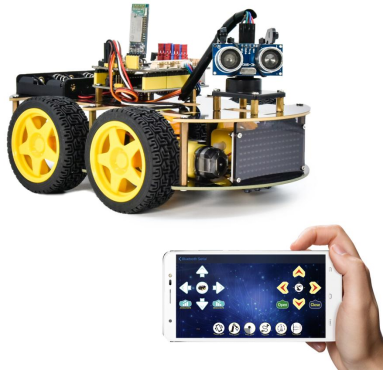
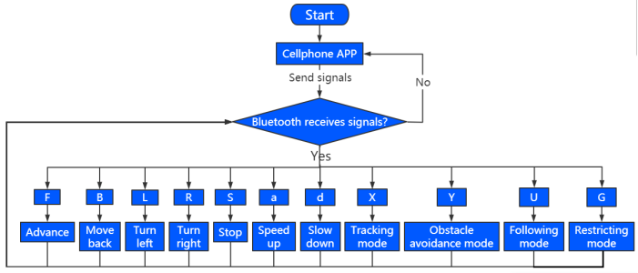
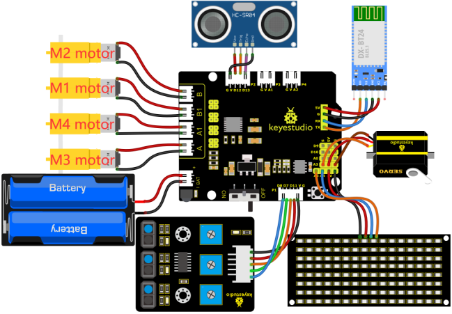

# Project 17 Multi-purpose Bluetooth Smart Car



**1.Description**

In previous projects, the car only performs a single function. However, in this lesson, we will integrate all of its functions via a Bluetooth.


**2.Flow Chart**




**3.Wiring Diagram**



1. GND, VCC, SDA and SCL of the 8*8 LED board are connected to G（GND), V（VCC), A4 and A5 of the expansion board.

2. The RXD, TXD, GND and VCC of the Bluetooth module are respectively connected to TX, RX, G and 5V on the 8833 motor driver expansion board, while the STATE and BRK pins of the Bluetooth module do not need to be connected. 

3. The servo is connected to G, V and A3. The brown wire is interfaced with Gnd(G), the red wire is interfaced with 5V(V) and the orange wire is interfaced with A3.

4. G, V, S1, S2 and S3 of the line tracking sensor are connected to G（GND), V（VCC), D11, D7 and D8 of the sensor expansion board.

5. VCC, Trig, Echo and Gnd of the ultrasonic sensor are connected to 5V(V), D12(S), D13(S) and Gnd(G)

6. The power is connected to the BAT port.


**4.Test Code**

```c
//*******************************************************************************
/*
keyestudio 4wd BT Car 
lesson 17
Bluetooth Multifunctional Car
http://www.keyestudio.com
*/ 
#define SCL_Pin  A5  //Set the clock pin to A5
#define SDA_Pin  A4  //Set data pin to A4
//Array, used to store the data of pattern, can be calculated by yourself or obtained from the modulus tool
unsigned char start01[] = {0x01,0x02,0x04,0x08,0x10,0x20,0x40,0x80,0x80,0x40,0x20,0x10,0x08,0x04,0x02,0x01};
unsigned char front[] = {0x00,0x00,0x00,0x00,0x00,0x24,0x12,0x09,0x12,0x24,0x00,0x00,0x00,0x00,0x00,0x00};
unsigned char back[] = {0x00,0x00,0x00,0x00,0x00,0x24,0x48,0x90,0x48,0x24,0x00,0x00,0x00,0x00,0x00,0x00};
unsigned char left[] = {0x00,0x00,0x00,0x00,0x00,0x00,0x44,0x28,0x10,0x44,0x28,0x10,0x44,0x28,0x10,0x00};
unsigned char right[] = {0x00,0x10,0x28,0x44,0x10,0x28,0x44,0x10,0x28,0x44,0x00,0x00,0x00,0x00,0x00,0x00};
unsigned char STOP01[] = {0x2E,0x2A,0x3A,0x00,0x02,0x3E,0x02,0x00,0x3E,0x22,0x3E,0x00,0x3E,0x0A,0x0E,0x00};
unsigned char clear[] = {0x00,0x00,0x00,0x00,0x00,0x00,0x00,0x00,0x00,0x00,0x00,0x00,0x00,0x00,0x00,0x00};
unsigned char speed_a[] = 
{0x00,0x40,0x20,0x10,0x08,0x04,0x02,0xff,0x02,0x04,0x08,0x10,0x20,0x40,0x00,0x00};
unsigned char speed_d[] = 
{0x00,0x02,0x04,0x08,0x10,0x20,0x40,0xff,0x40,0x20,0x10,0x08,0x04,0x02,0x00,0x00};

int left_ctrl = 2;//define the direction control pins of group B motor
int left_pwm = 5;//define the PWM control pins of group B motor
int right_ctrl = 4;//define the direction control pins of group A motor
int right_pwm = 6;//define the PWM control pins of group A motor
int speeds = 150; //Set the initial speed to 150

const int servopin = A3;//set the pin of servo to A3 

int L_pin = 11; //define the left tracking sensor pin as D11
int M_pin = 7; //define the middle tracking sensor pin as D7
int R_pin = 8; //define the right tracking sensor pin as D8
int L_val, M_val, R_val;

int trigPin = 12; //TRIG Pin be connected to D12
int echoPin = 13; //ECHO Pin be connected to D13
int distance, distance_l, distance_r;

char BLE_val;

void setup() {
  Serial.begin(9600);//Set baud rate to 9600
  pinMode(left_ctrl,OUTPUT);//set direction control pins of group B motor to OUTPUT
  pinMode(left_pwm,OUTPUT);//set PWM control pins of group B motor to OUTPUT
  pinMode(right_ctrl,OUTPUT);//set direction control pins of group A motor to OUTPUT
  pinMode(right_pwm,OUTPUT);//set PWM control pins of group A motor to OUTPUT
  servopulse(servopin,90);//the angle of servo is 90 degree
  delay(300);
  pinMode(L_pin, INPUT); //Tracking sensor pins are configured for input mode
  pinMode(M_pin, INPUT);
  pinMode(R_pin, INPUT);
  pinMode(trigPin, OUTPUT); //define TRIG as the output mode
  pinMode(echoPin, INPUT); //define ECHO as the input mode
  pinMode(SCL_Pin,OUTPUT);// Set the clock pin to output
  pinMode(SDA_Pin,OUTPUT);//Set the data pin to output
  matrix_display(clear);
  matrix_display(start01); //display start01 expression pattern
}

void loop() {
   if(Serial.available()>0) {
    BLE_val = Serial.read();
    Serial.println(BLE_val);
  } 
    switch(BLE_val)
    {
      case 'F' : car_front(); 
      matrix_display(clear);
      matrix_display(front);   
      break;
      
      case 'B' : car_back(); 
      matrix_display(clear);
      matrix_display(back); 
      break;

      case 'L' : car_left(); 
      matrix_display(clear);
      matrix_display(left); 
      break;
     
      case 'R' : car_right();
      matrix_display(clear);
      matrix_display(right);  
      break;
     
      case 'S' : car_Stop();
      matrix_display(clear);
      matrix_display(STOP01); 
      break;

      case 'a' : speeds_a();
      matrix_display(clear);
      matrix_display(speed_a);  
      break;
     
      case 'd' : speeds_d();
      matrix_display(clear);
      matrix_display(speed_d); 
      break;

      case  'U':  follow();  //Receiving ‘U’,enter follow mode
      break; 
      case  'Y':  avoid(); //Receiving ‘Y’,enter obstacle avoidance mode  
      break;  
      case  'G':  confinement(); //Receiving ‘G’,enter confinement mode
      break;  
      case  'X':  tracking(); //Receiving ‘X’,enter tracking mode
      break;  
    }
}

void car_front()//define the state of going front
{
  digitalWrite(left_ctrl,HIGH);
  analogWrite(left_pwm,(255-speeds));
  digitalWrite(right_ctrl,HIGH);
  analogWrite(right_pwm,(255-speeds));
}
void car_back()//define the status of going back
{
  digitalWrite(left_ctrl,LOW);
  analogWrite(left_pwm,speeds);
  digitalWrite(right_ctrl,LOW);
  analogWrite(right_pwm,speeds);
}
void car_left()//set the status of left turning
{
  digitalWrite(left_ctrl, LOW);
  analogWrite(left_pwm, speeds);  
  digitalWrite(right_ctrl, HIGH);
  analogWrite(right_pwm, (255-speeds));
}
void car_right()//set the status of right turning
{
  digitalWrite(left_ctrl, HIGH);
  analogWrite(left_pwm, (255-speeds));
  digitalWrite(right_ctrl, LOW);
  analogWrite(right_pwm, speeds);
}
void car_Stop()//define the state of stop
{
  digitalWrite(left_ctrl,LOW);
  analogWrite(left_pwm,0);
  digitalWrite(right_ctrl,LOW);
  analogWrite(right_pwm,0);
}

void speeds_a() { //rapidly growing function
  while (1) {
    Serial.println(speeds);  //display speed information 
    if (speeds < 255) { //Up to 255
      matrix_display(clear);
      matrix_display(speed_a);
      speeds++;
      delay(10);  //adjust the speed of growth 
    }
    BLE_val = Serial.read();
    if (BLE_val == 'S') //Receive 'S',the car stops accelerating
    break;
  }
}
void speeds_d() { //velocity reduction function
  while (1) {
    Serial.println(speeds);  //display speed information
    if (speeds > 0) { //down to 0
      matrix_display(clear);
      matrix_display(speed_d);
      speeds--;
      delay(10);    //adjust the speed of deceleration
    }
    BLE_val = Serial.read();
    if (BLE_val == 'S') //Receive 'S',the car stops deceleration
    break;
}
}

int get_distance() {
  int distance = 0;
  digitalWrite(trigPin, LOW);     // send pulse through Trig/Pin, trigger HC-SR04 ranging, so that send out ultrasonic signal interface low level 2μs
  delayMicroseconds(2);
  digitalWrite(trigPin, HIGH);    // make ultrasonic signal interface high level 10μs, here is at least 10μs
  delayMicroseconds(10);
  digitalWrite(trigPin, LOW);     // keep the ultrasonic signal interface low level
  distance = pulseIn(echoPin, HIGH) / 58; // read the pulse time and convert the pulse time to the distance (unit: cm)
  Serial.println(distance);        //output distance value
  return distance;
}

void follow() {
  servopulse(servopin,90);
  delay(200);
  int follow_flag = 1;
  while (follow_flag) {
    distance = get_distance(); //call the ranging function
    if (distance < 8 ) {//If the distance is less than 8
      car_back();//the car goes back
      matrix_display(clear);
      matrix_display(back); 
    }
    else if (distance >= 8 && distance < 13) { //If the distance is greater than or equal to 8, it's less than 13
      car_Stop();//stop
      matrix_display(clear);
      matrix_display(STOP01); 
    }
    else if (distance >= 13 && distance <= 35 ) { //If the distance is greater than or equal to 13, it's less than 35
      car_front();//the car goes forward
      matrix_display(clear);
      matrix_display(front);
    }
    else {//If none of the above
      car_Stop();//stop
      matrix_display(clear);
      matrix_display(STOP01); 
    }
    BLE_val = Serial.read();
    if (BLE_val == 'S') { //When S is received, the car stops
      follow_flag = 0;
      car_Stop();
    }
  }
}

void avoid() {
  int avoid_flag = 1;
  while (avoid_flag) {
    distance = get_distance(); //Call the ranging function
    if (distance > 0 && distance < 20) { //If the distance is less than 20 and greater than 0
      car_Stop();//stops
      matrix_display(clear);
      matrix_display(STOP01);   //the dot matrix displays a stop pattern
      delay(1000);
      servopulse(servopin,160); //bring the steering gear over 180 degrees
      delay(500);
      distance_l = get_distance(); //gets the left distance 
      delay(100);
      servopulse(servopin,20); //turn the steering gear to 0 degrees
      delay(500);
      distance_r = get_distance(); //get the right distance
      delay(100);
      if (distance_l > distance_r) { //compare the distance, if the left is bigger than the right
        car_left();  //the car turns left
        matrix_display(clear);
        matrix_display(left);   //the dot matrix shows a left pattern
        servopulse(servopin,90);//the steering gear returns to 90 degrees
        delay(700);
        matrix_display(clear);
        matrix_display(front);   //the dot matrix displays a forward pattern
      } 
      else { //Otherwise if the right is bigger than the left
        car_right();//the car turns right
        matrix_display(clear);
        matrix_display(right);   //the dot matrix shows a left pattern
        servopulse(servopin,90);//the steering gear returns to 90 degrees
        delay(700);
        matrix_display(clear);
        matrix_display(front);   //the dot matrix displays a forward pattern
      }
    }
    else { //When the front distance is less than or equal to 10cm
      car_front();//the car goes forward
      matrix_display(clear);
      matrix_display(front);   //the dot matrix displays a forward pattern

    }
    BLE_val = Serial.read();
    if (BLE_val == 'S') {//When S is received, the car stops
      avoid_flag = 0;
      car_Stop();
    }
  }
}

void confinement() {
  int confinement_flag = 1;
  while (confinement_flag) {
    L_val = digitalRead(L_pin); //read the value of the left sensor
    M_val = digitalRead(M_pin); //read the value of the middle sensor
    R_val = digitalRead(R_pin); //read the value of the right sensor
    if ( L_val == 0 && M_val == 0 && R_val == 0 ) { //the car goes forward when no black line is detected
      car_front();
    }
    else { //Otherwise, if any of the tracking sensors detect a black line, the goes back and then turns left
      car_back();
      delay(500);
      car_left();
      delay(800);
    }
    BLE_val = Serial.read();
    if (BLE_val == 'S') { //When S is received, the car stops
      confinement_flag = 0;
      car_Stop();
    }
  }
}

void tracking() {
  int track_flag = 1;
  while (track_flag) {
    L_val = digitalRead(L_pin); //read the value of the left sensor
    M_val = digitalRead(M_pin); //read the value of the middle sensor
    R_val = digitalRead(R_pin); //read the value of the right sensor
    if (M_val == 1) { //Black line detected in the middle
      if (L_val == 1 && R_val == 0) { //If a black line is detected on the left, but not on the right, turn left
        car_left();
      }
      else if (L_val == 0 && R_val == 1) { //Otherwise, if a black line is detected on the right and not on the left, turn right
        car_right();
      }
      else { //Otherwise, the car goes forward
        car_front();
      }
    }
    else { //no black lines detected in the middle
      if (L_val == 1 && R_val == 0) { //If a black line is detected on the left, but not on the right, turn left
        car_right();
      }
      else if (L_val == 0 && R_val == 1) { //Otherwise, if a black line is detected on the right and not on the left, turn right
        car_right();;
      }
      else { //Otherwise, stop
        car_Stop();
      }
    }
    BLE_val = Serial.read();
    if (BLE_val == 'S') { //When S is received, the car stops
      track_flag = 0;
      car_Stop();
    }
  }
}

void servopulse(int servopin,int myangle)//Steering gear running angle
{
  for(int i=0; i<30; i++)
  {
    int pulsewidth = (myangle*11)+500;
    digitalWrite(servopin,HIGH);
    delayMicroseconds(pulsewidth);
    digitalWrite(servopin,LOW);
    delay(20-pulsewidth/1000);
  }  
}

//this function is used for dot matrix display
void matrix_display(unsigned char matrix_value[])
{
  IIC_start();  //the function that calls the data transfer start condition
  IIC_send(0xc0);  //select address

  for (int i = 0; i < 16; i++) //the pattern data is 16 bytes
  {
    IIC_send(matrix_value[i]); //Transmit the data of the pattern
  }
  IIC_end();   //End pattern data transmission
  IIC_start();
  IIC_send(0x8A);  //Display control, select 4/16 pulse width
  IIC_end();
}
//Conditions under which data transmission begins
void IIC_start()
{
  digitalWrite(SDA_Pin, HIGH);
  digitalWrite(SCL_Pin, HIGH);
  delayMicroseconds(3);
  digitalWrite(SDA_Pin, LOW);
  delayMicroseconds(3);
  digitalWrite(SCL_Pin, LOW);
}
//Indicates the end of data transmission
void IIC_end()
{
  digitalWrite(SCL_Pin, LOW);
  digitalWrite(SDA_Pin, LOW);
  delayMicroseconds(3);
  digitalWrite(SCL_Pin, HIGH);
  delayMicroseconds(3);
  digitalWrite(SDA_Pin, HIGH);
  delayMicroseconds(3);
}
//transmit data
void IIC_send(unsigned char send_data)
{
  for (byte mask = 0x01; mask != 0; mask <<= 1) //Each byte has 8 bits and is checked bit by bit starting at the lowest level
  {
    if (send_data & mask) { //Sets the high and low levels of SDA_Pin depending on whether each bit of the byte is a 1 or a 0
      digitalWrite(SDA_Pin, HIGH);
    } else {
      digitalWrite(SDA_Pin, LOW);
    }
    delayMicroseconds(3);
    digitalWrite(SCL_Pin, HIGH); //Pull the clock pin SCL_Pin high to stop data transmission
    delayMicroseconds(3);
    digitalWrite(SCL_Pin, LOW); //pull the clock pin SCL_Pin low to change the SIGNAL of SDA 
  }
}
//*******************************************************************************
```

**5.Test Result**

After successfully uploading the code to the V4.0 board, connect the wiring according to the wiring diagram, power on the external power then turn the DIP switch to ON. 

After the Bluetooth module is plugged into the APP and the mobile APP is successfully connected to the Bluetooth, the smart car can be controlled by the mobile APP. We can achieve the corresponding functions by pressing the corresponding buttons on the mobile APP.  

Before uploading the test code, you need to remove the Bluetooth module, otherwise the code will fail to be uploaded. Connect the Bluetooth module after uploading the code successfully. 
