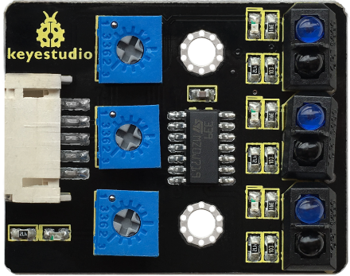
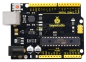
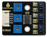
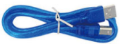

# Project 3: Line Tracking Sensor

**1.Description** 



The tracking sensor is actually an infrared sensor. The component used here is the TCRT5000 infrared tube. Its working principle is to use different reflectivity of infrared light to colors, then convert the strength of the reflected signal into a current signal. 

During the process of detection, black is active at HIGH level while white is active at LOW level. The detection height is 0-3 cm. 

Keyestudio 3-channel line tracking module has integrated 3 sets of TCRT5000 infrared tubes on a board, which is more convenient for wiring and control. 

By rotating the adjustable potentiometer on the sensor, it can adjust the detection sensitivity of the sensor.

**2.Specification**


- Operating Voltage: 3.3-5V (DC)
- Interface: 5PIN

- Output Signal: Digital signal

- Detection Height: 0-3 cm


Note: Before testing, rotate the potentiometer on the sensor to adjust the detection sensitivity.  The sensitivity is best when adjusting the LED to a threshold between ON and OFF.  


**3.Components**

| 4.0 Development Board *1                                     | 8833 Motor Driver Expansion Board *1                         | Red LED Module*1                                             | Line Tracking Sensor*1                                       |
| ------------------------------------------------------------ | ------------------------------------------------------------ | ------------------------------------------------------------ | ------------------------------------------------------------ |
|                                      |  |  |  |
| **5P Dupont Wire*1**                                         | **USB Cable*1**                                              | **3P Dupont Wire*1**                                         |                                                              |
|  |  |  |                                                              |


**4.Wiring Diagram**


G, V, S1, S2 and S3 of the line tracking sensor are connected to G（GND), V（VCC), D11, D7 and D8 of the sensor expansion board.


**5.Test Code**

```c
//****************************************************************************
/*
keyestudio 4wd BT Car
lesson 3.1 
 Line Track sensor
 http://www.keyestudio.com
*/
int L_pin = 11;  //pins of  left line tracking sensor
int M_pin = 7;  //pins of  middle line tracking sensor
int R_pin = 8;  //pins of  right  line tracking sensor
int val_L,val_R,val_M;// define the variable value of three sensors

void setup()
{
  Serial.begin(9600); // initialize serial communication at 9600 bits per second
  pinMode(L_pin,INPUT); // make the L_pin as an input
  pinMode(M_pin,INPUT); // make the M_pin as an input
  pinMode(R_pin,INPUT); // make the R_pin as an input
}

void loop() 
{ 
  val_L = digitalRead(L_pin);//read the L_pin:
  val_R = digitalRead(R_pin);//read the R_pin:
  val_M = digitalRead(M_pin);//read the M_pin:
  Serial.print("left:");
  Serial.print(val_L);
  Serial.print(" middle:");
  Serial.print(val_M);
  Serial.print(" right:");
  Serial.println(val_R);
  delay(500);// delay in between reads for stability
}
//****************************************************************************
```

**6.Test Result**

After successfully uploading the code to the V4.0 board, connect the wirings according to the wiring diagram, and use a USB cable to connect the computer to power the board.

After powering on, open the serial monitor and you will view status of three line tracking sensors. When no signals are received, the value is1. If we cover the sensor with a white paper, the value will be 0.


**7.Code Explanation**

**Serial.begin(9600)**- Initialize serial port, set baud rate to 9600

**pinMode- **Define the pin as input or output mode

**digitalRead-**Read the state of pin, which are generally HIGH and LOW level


**8.Extension Practice**

After knowing its working principle, you can connect an LED to D9 so as to control LED by it.


```c
//****************************************************************************
/*
keyestudio 4wd BT Car
lesson 3.2
 Line Track Sensor LED
 http://www.keyestudio.com
*/
int L_pin = 11;  //pins of  left line tracking sensor
int M_pin = 7;  //pins of  middle line tracking sensor
int R_pin = 8;  //pins of  right line tracking sensor
int val_L,val_R,val_M;// define the variables of three sensors 

void setup()
{
  Serial.begin(9600); // initialize serial communication at 9600 bits per second
  pinMode(L_pin,INPUT); // make the L_pin as an input
  pinMode(M_pin,INPUT); // make the M_pin as an input
  pinMode(R_pin,INPUT); // make the R_pin as an input
  pinMode(9, OUTPUT);
}

void loop() 
{ 
  val_L = digitalRead(L_pin);//read the L_pin:
  val_R = digitalRead(R_pin);//read the R_pin:
  val_M = digitalRead(M_pin);//read the M_pin:
  Serial.print("left:");
  Serial.print(val_L);
  Serial.print(" middle:");
  Serial.print(val_M);
  Serial.print(" right:");
  Serial.println(val_R);
  delay(500);// delay in between reads for stability
  if ((val_L == LOW) || (val_M == LOW) || (val_R == LOW))//if left line tracking sensor detects signals
  { 
    Serial.println("HIGH");
    digitalWrite(9, HIGH);//LED is off
  }
  else//if left line tracking sensor doesn’t detect signals
  { 
    Serial.println("LOW");
    digitalWrite(9, LOW);//LED is off
  }
 }
//****************************************************************************
```

After successfully uploading the code to the V4.0 board, connect the wirings according to the wiring diagram, and use a USB cable to connect the computer to power the board. 

After powering on, make a paper close to the sensor, then we can find the LED light up when covering the line tracking sensor.
