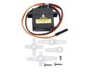
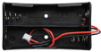
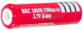
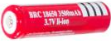

# Project 4 Servo Control

**1.Description** 


Servo motor is a position control rotary actuator. It mainly consists of a housing, a circuit board, a core-less motor, a gear and a position sensor. Its working principle is that the servo receives the signal sent by MCUs or receivers and produces a reference signal with a period of 20ms and width of 1.5ms, then compares the acquired DC bias voltage to the voltage of the potentiometer and obtain the voltage difference output.


In general, servo has three lines in brown, red and orange. The brown wire is grounded, the red one is a positive pole line and the orange one is a signal line.

The rotation angle of servo motor is controlled by regulating the duty cycle of PWM (Pulse-Width Modulation) signal. The standard cycle of PWM signal is 20ms (50Hz). Theoretically, the width is distributed between 1ms-2ms, but in fact, it's between 0.5ms-2.5ms. The width corresponds the rotation angle from 0° to 180°. But note that for different brand motors, the same signal may have different rotation angles.  


The corresponding servo angles are shown below:


**2.Specification**

  - Working voltage: DC 4.8V \~ 6V
  - Operating angle range: about 180 ° (at 500 → 2500 μsec)
  - Pulse width range: 500 → 2500 μsec
  - No-load speed: 0.12 ± 0.01 sec / 60 (DC 4.8V) 0.1 ± 0.01 sec / 60 (DC 6V)
  - No-load current: 200 ± 20mA (DC 4.8V) 220 ± 20mA (DC 6V)
  - Stopping torque: 1.3 ± 0.01kg · cm (DC 4.8V) 1.5 ± 0.1kg · cm (DC 6V)
  - Stop current: ≦ 850mA (DC 4.8V) ≦ 1000mA (DC 6V)
  - Standby current: 3 ± 1mA (DC 4.8V) 4 ± 1mA (DC 6V)


**3.Components**

| 4.0 Development Board *1                                     | 8833 Motor Driver Expansion Board *1                         | Servo*1                                                      |
| ------------------------------------------------------------ | ------------------------------------------------------------ | ------------------------------------------------------------ |
|  |  |  |
| **18650 Battery Holder*1**                                   | **USB Cable*1**                                              | **18650 Battery*2（self-provided）**                         |
|  |  |              |

**4.Wiring Diagram**


Wiring note: The servo is connected to G（GND）、V（VCC）and A3, the brown line of servo is linked with GND(G), the red one is connected to 5v(V) and the orange one is attached to A3.

The servo is obliged to connect to the external power due to its high demand for driving servo current. Generally, the current of development board is not big enough. If without connecting the external power, the development board could be burnt.


**5.Test Code**

```c
//****************************************************************************
/*
keyestudio 4wd BT Car
lesson 4.1
Servo
http://www.keyestudio.com
*/
#define servoPin A3  //servo Pin
int pos; //the angle variable of servo
int pulsewidth; //pulse width variable of servo

void setup() {
  pinMode(servoPin, OUTPUT);  //set the pins of servo to output
  procedure(0); //set the angle of servo to 0 degree
}

void loop() {
  for (pos = 0; pos <= 180; pos += 1) { // goes from 0 degrees to 180 degrees
    // in steps of 1 degree
    procedure(pos);              // tell servo to go to position in variable 'pos'
    delay(15);                   //control the rotation speed of servo
  }
  for (pos = 180; pos >= 0; pos -= 1) { // goes from 180 degrees to 0 degrees
    procedure(pos);              // tell servo to go to position in variable 'pos'
    delay(15);                    
  }
}
  
//function to control servo
void procedure(int myangle) {
  pulsewidth = myangle * 11 + 500;  //calculate the value of pulse width
  digitalWrite(servoPin,HIGH);
  delayMicroseconds(pulsewidth);   //The duration of high level is pulse width
  digitalWrite(servoPin,LOW);
  delay((20 - pulsewidth / 1000));  //the cycle is 20ms, the low level last for the rest of time
}
//****************************************************************************
```


**6.Test Result**

After successfully uploading the code to the V4.0 board, connect the wirings according to the wiring diagram, and power on the external power. 

After powering on, turn the dip switch to the "ON" end, then servo will swing in the range of 0° to 180°.


**7.Extension Practice**

What’s more, we empower to control the servo via library file. Please refer to the link:
[<span class="underline">https://www.arduino.cc/en/Reference/Servo</span>](https://www.arduino.cc/en/Reference/Servo).


```c
//***************************************************************************
/*
 keyestudio 4wd BT Car
 lesson 4.2
 Servo
 http://www.keyestudio.com
*/
#include <Servo.h>
Servo myservo;  // create servo object to control a servo
// twelve servo objects can be created on most boards
int pos = 0;    // variable to store the servo position

void setup() {
  myservo.attach(A3);  // attaches the servo on pin A3 to the servo object
}
void loop() {
  for (pos = 0; pos <= 180; pos += 1) { // goes from 0 degrees to 180 degrees
    // in steps of 1 degree
    myservo.write(pos);              // tell servo to go to position in variable 'pos'
    delay(15);                       // waits 15ms for the servo to reach the position
  }
  for (pos = 180; pos >= 0; pos -= 1) { // goes from 180 degrees to 0 degrees
    myservo.write(pos);              // tell servo to go to position in variable 'pos'
    delay(15);                       // waits 15ms for the servo to reach the position
  }
}
//***************************************************************************
```

After successfully uploading the code to the V4.0 board, connect the wirings according to the wiring diagram, and power on the external power. 

After powering on, turn the dip switch to the "ON" end, then servo will swing in the range of 0° to 180° too. We usually control it by library file.


**8.Code Explanation**

Arduino comes with **\#include \<Servo.h\>** (servo function and statement）

The following are some common statements of the servo function:

1\. **attach（interface）**——Set interface of the servo

2\. **write（angle）**——Used to set rotation angle of servo, and the set angle range is from 0° to 180°

3\. **read（）**——used to read angle of servo, namely, reading the command value of“write()”

4\. **attached（）**——Judge if the parameter of servo is sent to its interface

Note: The above written format is“servo variable name, specific statement（）”, for instance: myservo.attach(9).
