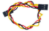

# Project 5 Ultrasonic Sensor

**1.Description** 


The HC-SR04 ultrasonic sensor uses sonar to determine distance to an object like what bats do. It offers excellent non-contact range detection with high accuracy and stable readings in an easy-to-use package. It comes complete with an ultrasonic transmitter and receiver modules.

The HC-SR04 or the ultrasonic sensor is being used in a wide range of electronics projects for creating obstacle detection and distance measuring application as well as various other applications. Here we have brought the simple method to measure the distance with arduino and an ultrasonic sensor and how to use the ultrasonic sensor with Arduino.


**2.Specification**


- Working Voltage :+5V DC
- Quiescent Current : \<2mA

- Working Current: 15mA

- Effectual Angle: \<15°

- Distance Range : 2cm – 300 cm

- Precision : 0.3 cm

- Measuring Angle: 30 degree

- Trigger Input Pulse width: 10uS


**3.Components**

| 4.0 Development Board *1                                     | 8833 Motor Driver Expansion Board *1                         | Red LED Module*1                                             | HC-SR04 Ultrasonic Sensor*1                                  |
| ------------------------------------------------------------ | ------------------------------------------------------------ | ------------------------------------------------------------ | ------------------------------------------------------------ |
|  |  |  |  |
| **4P Dupont Wire*1**                                         | **USB Cable*1**                                              | **3P Dupont Wire*1**                                         |                                                              |
|  |  |  |                                                              |

**4.Working Principle**

As the above picture shown, it is like two eyes. One is transmitting end, the other is receiving end.

The ultrasonic module will emit the ultrasonic waves after triggering a signal. When the ultrasonic waves encounter the object and are reflected back, the module outputs an echo signal, so it can determine the distance of the object from the time difference between the trigger signal and the echo signal. 

The t is the time that emitting signal meets obstacle and returns. And the propagation speed of sound in the air is about 343m/s, and distance = speed * time. However, the ultrasonic wave emits and comes back, which is 2 times of distance. Therefore, it needs to be divided by 2, the distance measured by ultrasonic wave = (speed * time)/2

**Use method and chart of ultrasonic module:**

1. Use the GPIO pin to give a high level signal of at least 10μs to the Trig pin of SR04, which can trigger it to detect distance.

2. After triggering, the module will automatically send eight 40KHz ultrasonic pulses and detect whether there is a signal return. This step will be completed automatically by the module.

3. If the signal returns, the Echo pin will output a high level, and the duration of the high level is the time from the transmission of the ultrasonic wave to the return.

   


**Circuit diagram of ultrasonic sensor:**


**5.Wiring Diagram**


VCC, Trig, Echo and Gnd of the ultrasonic sensor are connected to 5V(V), D12, D13 and GND(G).


**6.Test Code**

```c
//***************************************************************************
/*
 keyestudio 4wd BT Car
 lesson 5.1
 Ultrasonic Sensor
 http://www.keyestudio.com
*/ 
int trigPin = 12;    // Trigger
int echoPin = 13;    // Echo
long duration, cm, inches;
void setup() {
  //Serial Port begin
  Serial.begin (9600);
  //Define inputs and outputs
  pinMode(trigPin, OUTPUT);
  pinMode(echoPin, INPUT);
}

void loop() {
  // The sensor is triggered by a HIGH pulse of 10 or more microseconds.
  // Give a short LOW pulse beforehand to ensure a clean HIGH pulse:
  digitalWrite(trigPin, LOW);
  delayMicroseconds(2);
  digitalWrite(trigPin, HIGH);
  delayMicroseconds(10);
  digitalWrite(trigPin, LOW);
   // Read the signal from the sensor: a HIGH pulse whose
  // duration is the time (in microseconds) from the sending
  // of the ping to the reception of its echo off of an object.
  duration = pulseIn(echoPin, HIGH);
   // Convert the time into a distance
  cm = (duration/2) / 29.1;     // Divide by 29.1 or multiply by 0.0343
  inches = (duration/2) / 74;   // Divide by 74 or multiply by 0.0135
  Serial.print(inches);
  Serial.print("in, ");
  Serial.print(cm);
  Serial.print("cm");
  Serial.println();
  delay(250);
}
//***************************************************************************
```

**7. Test Result**

After successfully uploading the code to the V4.0 board, connect the wirings according to the wiring diagram, then connect the computer via a USB cable to power the board. After powering on, open the serial monitor and set baud rate to 9600. 

The detected distance will be displayed, and the unit is cm and inch. Hinder the ultrasonic sensor by hand, the displayed distance value gets smaller.


**8.Code Explanation**

**int trigPin-** this pin is defined to transmit ultrasonic waves, generally output.

**int echoPin -** this is defined as the pin of reception, generally input

**cm = (duration/2) / 29.1-**

**inches = (duration/2) / 74-**

We can calculate the distance by using the following formula:

distance = (traveltime/2) x speed of sound

The speed of sound is: 343m/s = 0.0343 cm/us = 1/29.1 cm/us

Or in inches: 13503.9in/s = 0.0135in/us = 1/74in/us

We need to divide the traveltime by 2 for we have to take into account that the wave was sent, hit the object, and then returned back to the sensor.


**9.Extension Practice**

We have just measured the distance displayed by the ultrasonic. How about controlling the LED with the measured distance? Let's try it and connect an LED light module to the D9 pin.


```c
//*****************************************************************
/*
 keyestudio 4wd BT Car
 lesson 5.2
 Ultrasonic LED
 http://www.keyestudio.com
*/ 
int trigPin = 12;    // Trigger
int echoPin = 13;    // Echo
long duration, cm, inches;

void setup() {
  Serial.begin (9600);  //Serial Port begin
  pinMode(trigPin, OUTPUT);  //Define inputs and outputs
  pinMode(echoPin, INPUT);
}

void loop() 
{
  // The sensor is triggered by a HIGH pulse of 10 or more microseconds.
  // Give a short LOW pulse beforehand to ensure a clean HIGH pulse:
  digitalWrite(trigPin, LOW);
  delayMicroseconds(2);
  digitalWrite(trigPin, HIGH);
  delayMicroseconds(10);
  digitalWrite(trigPin, LOW);
  // Read the signal from the sensor: a HIGH pulse whose
  // duration is the time (in microseconds) from the sending
  // of the ping to the reception of its echo off of an object.
  duration = pulseIn(echoPin, HIGH);
  // Convert the time into a distance
  cm = (duration/2) / 29.1;     // Divide by 29.1 or multiply by 0.0343
  inches = (duration/2) / 74;   // Divide by 74 or multiply by 0.0135
  Serial.print(inches);
  Serial.print("in, ");
  Serial.print(cm);
  Serial.print("cm");
  Serial.println();
  delay(250);
  if (cm>=2 && cm<=10)
  {
    Serial.println("HIGH");
    digitalWrite(9, HIGH);
  }
  else
  {
    Serial.println("LOW");
    digitalWrite(9, LOW);
  }
}
//*****************************************************************
```


After successfully uploading the code to the V4.0 board, connect the wirings according to the wiring diagram, then connect the computer via a USB cable to power the board. After powering on, block the ultrasonic sensor by hand(the distance is between 2-10cm), then check if the LED is on.
