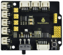
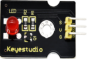
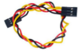
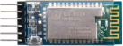
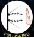

# Project 7 Bluetooth Remote Control

**1.Description**


There is a DX-BT24 5.1 Bluetooth module in this kit. This bluetooth module comes with 256Kb space and complies with V5.1BLE bluetooth specification, which supports AT commands. Users can change parameters such as the baud rate and device name of the serial port as required. 

Furthermore, it supports UART interface and bluetooth serial port transparent transmission, which also contains the advantages of low cost, small size, low power consumption and high sensitivity for sending and receiving. Notably, it solely needs a few peripheral components to realize its powerful functions.


**2.Specification**

  - Bluetooth protocol: Bluetooth Specification V5.1 BLE
  - Working distance: In an open environment, it can achieve 40m ultra-long distance communication
  - Operating frequency: 2.4GHz ISM band
  - Communication interface: UART
  - Bluetooth certification: [Accord](javascript:;) with FCC CE ROHS REACH certification standard
  - Serial port parameters: 9600, 8 data bits, 1 stop bit, invalid bit, no flow control
  - Power: 5V DC
  - Operating temperature: –10℃ to +65℃


**3.Application**

The DX-BT24 module also supports the BT5.1 BLE protocol, which can be directly connected to iOS devices with BLE Bluetooth function, and supports resident running of background programs. 

It is mainly used in the field of short-distance data wireless transmission. It enables to avoid cumbersome cable connections and can directly replace serial cables. Successful application areas of BT24 modules:

※ Bluetooth wireless data transmission;

※ Mobile phone, computer peripheral equipment;

※ Handheld POS equipment;

※ Wireless data transmission of medical equipment;

※ Smart home control;

※ Bluetooth printer;

※ Bluetooth remote control toys;

※ Shared bicycles;


**4.Ports**


①STATE: Status pin

②RX: Receiving pin

③TX: sending pin

④GND: GND

⑤VCC: Power

⑥EN: Enable pin

Connect the BT module to the development board.

<table>
<tbody>
<tr class="odd">
<td>Uno</td>
<td>BT24</td>
</tr>
<tr class="even">
<td>TX</td>
<td>RX</td>
</tr>
<tr class="odd">
<td>RX</td>
<td>TX</td>
</tr>
<tr class="even">
<td>VCC</td>
<td>5V</td>
</tr>
<tr class="odd">
<td>GND</td>
<td>GND</td>
</tr>
</tbody>
</table>


**5.Components**

| 4.0 Development Board *1                                     | 8833 Motor Driver Expansion Board *1                         | Red LED Module*1                                             |
| ------------------------------------------------------------ | ------------------------------------------------------------ | ------------------------------------------------------------ |
|  |  |  |
| **3P F-F Dupont Wire*1**                                     | **USB Cable*1**                                              | **DX-BT24 Bluetooth Module*1**                               |
|  |  |  |


**6.Wiring Diagram**


RXD, TXD, GND and VCC of the BT module are connected to TX, RX, G and 5V.

STATE and BRK of the BT module don’t need connection.

Note the direction of the BT module when inserting it onto the 8833 board. And don’t insert it before uploading the code.


**7.Test Code**

```c
//***********************************************************************
/*
keyestudio 4wd BT Car
lesson 7.1
Bluetooth 
http://www.keyestudio.com
*/
char ble_val; //character variable, used to store the value received by Bluetooth 
void setup() {
  Serial.begin(9600);
}
void loop() {
  if(Serial.available() > 0)  //make sure if there is data in serial buffer
  {
    ble_val = Serial.read();  //Read data from serial buffer
    Serial.println(ble_val);  //Print
  }
}
//***********************************************************************
```


​    

**8.Test Result**

Don’t connect the BT module when uploading the code because serial communication port will be occupied when uploading code and inserting the BT module.

After successfully uploading the code to the V4.0 board, connect the wirings according to the wiring diagram, then connect the computer via a USB cable to power the board. After powering on, insert the BT module and the LED will flash, then we need to download the BT app.


**9.Download Bluetooth APP**

**Apple system**

Open the App Store on the iPhone. Search keyes BT car and download the APP to your phone.


After installation, enter its interface.


Click "Connect" button in the upper left corner to automatically search for Bluetooth. When BT24 is found, click "Connect" to connect Bluetooth, and then click to enter the control interface of 4WD smart car. 


Android System

Enter google play store to search for“keyes 4wd”


The app icon is shown below after installation.


Click app to enter the following page.


After connecting Bluetooth, plug in power and LED indicator of Bluetooth module will flicker. 

Tap“Connect”to search the Bluetooth.


When BT24 is found, click "connect" to connect Bluetooth. When "connect" turns into "is connected", it indicates that the Bluetooth connection is successful. 

As shown in the picture below, the Bluetooth LED becomes will stay on.


After connecting Bluetooth module, open serial monitor to set baud rate to 9600. 

Pressing the button of the Bluetooth APP, and the corresponding characters will be displayed, as shown below:


| Key                                                          | **Control character**                    | Function                                                     |
| ------------------------------------------------------------ | ---------------------------------------- | ------------------------------------------------------------ |
|  |                                          | Pair DX-BT24 5.1 Bluetooth module                            |
|  |                                          | Disconnect Bluetooth                                         |
|  | Press: F<br />Release: S                 | Press the button, the car  goes front; release to stop       |
|  | Press: L<br />Release: S                 | Press the button, the car turns left; release to stop        |
|  | Press: R<br />Release: S                 | Press the button, the car turns right; release to stop       |
|  | Press: B<br />Release: S                 | Press the button, the car goes back; release to stop         |
|  | Press: “a”<br />Release: “S”             | Click to speed up(maximum:255)                               |
|  | Press: “d”<br />Release: “S”             | Click to slow down(minimum:0)                                |
|  |                                          | Click to start the gravity sensing function of the mobile phone: click again to exit the gravity sensing control |
|  | Click to send“X”, click again to send“S” | Start line tracking function; click again to exit            |
|  | Click to send“Y”, click again to send“S” | Start ultrasonic avoiding function; click again to exit      |
|  | Click to send“U”, click again to send“S” | Start ultrasonic follow function; click  again to exit       |
|  | Click to send“G”, click again to send“S” | Start restricting function; click  again to exit             |

**10.Code Explanation**

**Serial.available()** 

Return the number of characters currently remaining in the serial port buffer. Generally, this function is used to judge whether there is data in the buffer of the serial port. When Serial.available()>0, it means that the serial port has received data and can be read; 

**Serial.read() **

Refers to taking out and reading a Byte of data from the serial port buffer. For example, if a device sends data to Arduino through the serial port, we can use Serial.read() to read the sent data.


**11.Extension Practice**

Here we look to use the command sent by the mobile phone to turn on or off an LED light. Looking at the wiring diagram, an LED is connected to the D9 pin.

```c
//****************************************************************************
/*
 keyestudio smart turtle robot
 lesson 7.2
 Bluetooth LED
 http://www.keyestudio.com
*/ 
int ledpin=9;
char ble_val;// An integer variable used to store the value received by Bluetooth

void setup()
{
  Serial.begin(9600);
  pinMode(ledpin,OUTPUT);
}

void loop()
{ 
  if (Serial.available() > 0) //Check whether there is data in the serial port cache
  {
    ble_val = Serial.read();  //Read data from the serial port cache
    Serial.print("DATA RECEIVED:");
    Serial.println(ble_val);
    if (ble_val == 'F') {
      digitalWrite(ledpin, HIGH);
      Serial.println("led on");
    }
    if (ble_val == 'B') {
      digitalWrite(ledpin, LOW);
      Serial.println("led off");
    }
   }
}
//****************************************************************************
```

After successfully uploading the code to the V4.0 board, connect the wirings according to the wiring diagram, then connect the computer via a USB cable to power the board. 

After powering on, clickandto control the LED.
