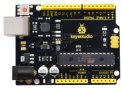
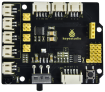
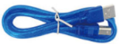
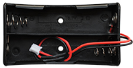
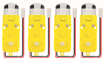
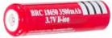

# Project 8 Motor Driving and Speed Control


**1.Description** 

There are many ways to drive motors. Our car uses the most commonly used DRV8833 motor driver chip, which provides a two-channel bridge electric drive solution for toys, printers and other integrated motor applications.

When we stack the driver expansion board on the 4.0 development board and power on the BAT, then set the DIP switch to the ON end, the external power supply will power on the two boards at the same time. To facilitate wiring connections, the driver expansion board comes with an anti-reverse port (PH2.0-2P-3P-4P-5P). You can connect the motors, power supply, and sensor modules directly to the driver expansion board. 

The Bluetooth interface of the driver expansion board is fully compatible with the DX-BT24 5.1 Bluetooth module. When connecting the Bluetooth module, you solely need to plug it into the corresponding interface. At the same time, 2.54 row pins are used to draw out some unused digital and analog ports on the driver expansion board, making it accessible  for you to add other sensors and carry out extension experiments. 

The expansion board can be connected to four DC motors. When the jumper cap is connected by default, the motors of ports A and A1 and B and B1 are connected in parallel and have the same motion law. 8 jumper caps can be used to control the rotation direction of the 4 motor interfaces. 

For example, when the 2 jumper caps in front of B1 of the M1 motor change from transverse connection to longitudinal connection, the rotation direction of M1 motor will be opposite to the original rotation direction. 


**2.Specification**

- Input voltage for logic：DC 5V

- Input voltage for driving：DC 6-9 V

- Working current for logic：\<36mA

- Working current for driving：\<2A

- Maximum power dissipation：25W（T=75℃）

- Input level for control signal：high level is 2.3V\<Vin\<5V ，low level is -0.3V\<Vin\<1.5V

- Working temperature：-25＋130℃


**Keyestudio 8833 motor driver expansion board**


**3.Working Principle**

We use the same side parallel connection mode for the four motors, which can be regarded as two groups of motors. As shown in the wiring diagram, B and B1 are a group, and A and A1 are a group. 

The motors in the same group should rotate in the same direction. If they are different, please adjust the corresponding jumper caps next to the terminal to change the direction. 

As shown below, if the directions of A and A1 are different, adjust the direction of jumper caps until the motor movement direction of the same group is consistent. 


From the above diagram, it is known that the direction pin of A motor is D4, the speed pin is D6; D2 is the direction pin of B motor; and D6 is speed pin.

PWM drives the robot car. The PWM value is in the range of 0-255. When we set the direction to HIGH, the smaller the PWM number, the faster the rotation of the motor.

|            | D2   | D5（PWM） | B Motor（ left）     | D4   | D6（PWM） | A Motor（right）     |
| ---------- | ---- | --------- | -------------------- | ---- | --------- | -------------------- |
| Go forward | HIGH | 255-200   | Rotate clockwise     | HIGH | 255-200   | Rotate clockwise     |
| Go back    | LOW  | 200       | Rotate anticlockwise | LOW  | 200       | Rotate anticlockwise |
| Turn left  | HIGH | 255-200   | Rotate clockwise     | LOW  | 200       | Rotate anticlockwise |
| Turn right | LOW  | 200       | Rotate anticlockwise | HIGH | 255-200   | Rotate clockwise     |


**4.Components**

| 4.0 Development Board *1                                     | 8833 Motor Driver Expansion Board *1                         | USB Cable*1                                                  |
| ------------------------------------------------------------ | ------------------------------------------------------------ | ------------------------------------------------------------ |
|  |  |  |
| 18650 Battery Holder*1                                       | Motor*4                                                      | 18650 Battery *2（self-provided）                            |
|  |  |  |


**5.Wiring Diagram**


Connect the power supply to the BAT port.


**6.Test Code**

```c
//****************************************************************************
/*
 keyestudio 4wd BT Car
 lesson 8.1
 Motor driver shield
 http://www.keyestudio.com
*/ 
#define ML_Ctrl 2     //define the direction control pins of group B motor
#define ML_PWM 5   //define the PWM control pins of group B motor
#define MR_Ctrl 4    //define the direction control pins of group A motor
#define MR_PWM 6   //define the PWM control pins of group A motor

void setup()
{
  pinMode(ML_Ctrl, OUTPUT);//set direction control pins of group B motor to output
  pinMode(ML_PWM, OUTPUT);//set PWM control pins of group B motor to output
  pinMode(MR_Ctrl, OUTPUT);//set direction control pins of group A motor to output
  pinMode(MR_PWM, OUTPUT);//set PWM control pins of group A motor to output
}
void loop()
{ 
  //front
  digitalWrite(ML_Ctrl,HIGH);//set the direction control pins of group B motor to HIGH
  analogWrite(ML_PWM,55);//set the PWM control speed of group B motor to 55
  digitalWrite(MR_Ctrl,HIGH);//set the direction control pins of group A motor to HIGH
  analogWrite(MR_PWM,55);// set the PWM control speed of group A motor to 55
  delay(2000);//delay in 2000ms
  //back
  digitalWrite(ML_Ctrl,LOW);//set the direction control pins of group B motor to LOW level
  analogWrite(ML_PWM,200);// set the PWM control speed of group B motor to 200 
  digitalWrite(MR_Ctrl,LOW);//set the direction control pins of group A motor to LOW level
  analogWrite(MR_PWM,200);//set the PWM control speed of group A motor to 200
  delay(2000);//delay in 2000ms
  //left
  digitalWrite(ML_Ctrl,LOW);//set the direction control pins of group B motor to LOW level
  analogWrite(ML_PWM,200);//set the PWM control speed of group B motor to 200 
  digitalWrite(MR_Ctrl,HIGH);//set the direction control pins of group A motor to HIGH level
  analogWrite(MR_PWM,55);//set the PWM control speed of group A motor to 200
  delay(2000);//delay in 2000ms
  //right
  digitalWrite(ML_Ctrl,HIGH);//set the direction control pins of group B motor to HIGH level
  analogWrite(ML_PWM,55);//set the PWM control speed of group B motor to 55 
  digitalWrite(MR_Ctrl,LOW);// set the direction control pins of group A motor to LOW level
  analogWrite(MR_PWM,200);//set the PWM control speed of group A motor to 200
  delay(2000);//delay in 2000ms
  //stop
  digitalWrite(ML_Ctrl, LOW);// set the direction control pins of group B motor to LOW level
  analogWrite(ML_PWM,0);//set the PWM control speed of group B motor to 0
  digitalWrite(MR_Ctrl, LOW);// set the direction control pins of group A motor to LOW level
  analogWrite(MR_PWM,0);//set the PWM control speed of group A motor to 0
  delay(2000);// delay in 2000ms
}
//****************************************************************************
```

**7.Test Result**

After successfully uploading the code to the V4.0 board, connect the wirings according to the wiring diagram.

Power on the external power and turn the DIP switch to ON, the car will go forward for 2s, back for 2s, turn left for 2s and right for 2s and stop for 2s.


**8.Code Explanation**

**digitalWrite(ML\_Ctrl,LOW):** 

The rotation direction of motor is decided by the high/low level and and the pins that decide rotation direction are digital pins.

**analogWrite(ML\_PWM,200):** 

The speed of motor is regulated by PWM, and the pins that decide the speed of motor must be PWM pins.


**9.Code Explanation**

Adjust the speed that PWM controls the motor, hook up in the same way.

```c
//************************************************************************
/*
 keyestudio 4wd BT Car
 lesson 8.2
 Motor driver
 http://www.keyestudio.com
*/ 
#define ML_Ctrl 2     //define the direction control pins of group B motor
#define ML_PWM 5   //define the PWM control pins of group B motor
#define MR_Ctrl 4    //define the direction control pins of group A motor
#define MR_PWM 6   //define the PWM control pins of group A motor

void setup()
{
  pinMode(ML_Ctrl, OUTPUT);//set direction control pins of group B motor to output
  pinMode(ML_PWM, OUTPUT);//set PWM control pins of group B motor to output
  pinMode(MR_Ctrl, OUTPUT);//set direction control pins of group A motor to output
  pinMode(MR_PWM, OUTPUT);//set PWM control pins of group A motor to output
}
void loop()
{ 
  //front
  digitalWrite(ML_Ctrl,HIGH);//set the direction control pins of group B motor to HIGH
  analogWrite(ML_PWM,105);//set the PWM control speed of group B motor to 55
  digitalWrite(MR_Ctrl,HIGH);//set the direction control pins of group A motor to HIGH
  analogWrite(MR_PWM,105);// set the PWM control speed of group A motor to 55
  delay(2000);//delay in 2000ms
  //back
  digitalWrite(ML_Ctrl,LOW);//set the direction control pins of group B motor to LOW level
  analogWrite(ML_PWM,150);// set the PWM control speed of group B motor to 200 
  digitalWrite(MR_Ctrl,LOW);//set the direction control pins of group A motor to LOW level
  analogWrite(MR_PWM,150);//set the PWM control speed of group A motor to 200
  delay(2000);//delay in 2000ms
  //left
  digitalWrite(ML_Ctrl,LOW);//set the direction control pins of group B motor to LOW level
  analogWrite(ML_PWM,150);//set the PWM control speed of group B motor to 200 
  digitalWrite(MR_Ctrl,HIGH);//set the direction control pins of group A motor to HIGH level
  analogWrite(MR_PWM,105);//set the PWM control speed of group A motor to 200
  delay(2000);//delay in 2000ms
  //right
  digitalWrite(ML_Ctrl,HIGH);//set the direction control pins of group B motor to HIGH level
  analogWrite(ML_PWM,105);//set the PWM control speed of group B motor to 55 
  digitalWrite(MR_Ctrl,LOW);// set the direction control pins of group A motor to LOW level
  analogWrite(MR_PWM,150);//set the PWM control speed of group A motor to 200
  delay(2000);//delay in 2000ms
  //stop
  digitalWrite(ML_Ctrl, LOW);// set the direction control pins of group B motor to LOW level
  analogWrite(ML_PWM,0);//set the PWM control speed of group B motor to 0
  digitalWrite(MR_Ctrl, LOW);// set the direction control pins of group A motor to LOW level
  analogWrite(MR_PWM,0);//set the PWM control speed of group A motor to 0
  delay(2000);// delay in 2000ms
}
//************************************************************************
```

After successfully uploading the code to the V4.0 board, connect the wirings according to the wiring diagram, then power on the external power and turn the DIP switch to ON, then you find the speed of the motor is much slower.

Note: Low battery will lead to slow motor speed.
